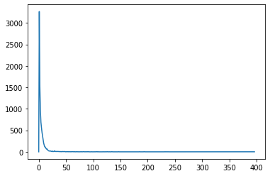

# PATENT NETWORK


```python
import numpy as np
import pandas as pd 
import json
import timeit
import networkx as nx
import matplotlib.pyplot as plt
```

## Loading patents


```python
ids = pd.read_csv(r"../../data/gp-q2-7topics.csv",index_col='code',skipinitialspace=True)
print(ids.isnull().sum())
ids 
```

    Unnamed: 0            0
    title                 0
    pub_date              0
    citations             0
    abstract              0
    class                 0
    year                  0
    abstract_processed    0
    topic                 0
    dtype: int64
    


<div>
<style scoped>
    .dataframe tbody tr th:only-of-type {
        vertical-align: middle;
    }

    .dataframe tbody tr th {
        vertical-align: top;
    }

    .dataframe thead th {
        text-align: right;
    }
</style>
<table border="1" class="dataframe">
  <thead>
    <tr style="text-align: right;">
      <th></th>
      <th>Unnamed: 0</th>
      <th>title</th>
      <th>pub_date</th>
      <th>citations</th>
      <th>abstract</th>
      <th>class</th>
      <th>year</th>
      <th>abstract_processed</th>
      <th>topic</th>
    </tr>
    <tr>
      <th>code</th>
      <th></th>
      <th></th>
      <th></th>
      <th></th>
      <th></th>
      <th></th>
      <th></th>
      <th></th>
      <th></th>
    </tr>
  </thead>
  <tbody>
    <tr>
      <td>US8370262B2</td>
      <td>0</td>
      <td>System and method for performing secure online...</td>
      <td>2013-02-05</td>
      <td>['US10681025B2', 'CN106664208B', 'AU2012261635...</td>
      <td>\nThe system and method performing secure onli...</td>
      <td>G06</td>
      <td>2013</td>
      <td>\nthe system and method performing secure onli...</td>
      <td>4</td>
    </tr>
    <tr>
      <td>US10237070B2</td>
      <td>1</td>
      <td>System and method for sharing keys across auth...</td>
      <td>2019-03-19</td>
      <td>['US10268809B2', 'JP6538821B2', 'KR101721032B1...</td>
      <td>\nA system, apparatus, method, and machine rea...</td>
      <td>H04</td>
      <td>2019</td>
      <td>\na system apparatus method and machine readab...</td>
      <td>4</td>
    </tr>
    <tr>
      <td>US10637853B2</td>
      <td>2</td>
      <td>Authentication techniques including speech and...</td>
      <td>2020-04-28</td>
      <td>['US10706421B2', 'US20160269411A1', 'US1021258...</td>
      <td>\nA system, apparatus, method, and machine rea...</td>
      <td>H04</td>
      <td>2020</td>
      <td>\na system apparatus method and machine readab...</td>
      <td>4</td>
    </tr>
    <tr>
      <td>US10558974B2</td>
      <td>3</td>
      <td>Methods and systems of providing verification ...</td>
      <td>2020-02-11</td>
      <td>['US20190149537A1', 'US20180308098A1', 'US2018...</td>
      <td>\nA method and system of providing verificatio...</td>
      <td>G06</td>
      <td>2020</td>
      <td>\na method and system of providing verificatio...</td>
      <td>4</td>
    </tr>
    <tr>
      <td>US10769635B2</td>
      <td>4</td>
      <td>Authentication techniques including speech and...</td>
      <td>2020-09-08</td>
      <td>['US9531710B2', 'US10706421B2', 'US20160269411...</td>
      <td>\nA system, apparatus, method, and machine rea...</td>
      <td>G06</td>
      <td>2020</td>
      <td>\na system apparatus method and machine readab...</td>
      <td>1</td>
    </tr>
    <tr>
      <td>...</td>
      <td>...</td>
      <td>...</td>
      <td>...</td>
      <td>...</td>
      <td>...</td>
      <td>...</td>
      <td>...</td>
      <td>...</td>
      <td>...</td>
    </tr>
    <tr>
      <td>KR100477956B1</td>
      <td>9471</td>
      <td>System and method for filtering message edited...</td>
      <td>2005-03-23</td>
      <td>['US9501746B2', 'US10110519B2', 'US7133898B1',...</td>
      <td>\r\nA method and system for filtering a messag...</td>
      <td>H04</td>
      <td>2005</td>
      <td>\r\na method and system for filtering a messag...</td>
      <td>6</td>
    </tr>
    <tr>
      <td>FR3092468A1</td>
      <td>9472</td>
      <td>Secure registration and building control system</td>
      <td>2020-08-07</td>
      <td>['US20150173255A1', 'US10147307B2', 'US9135807...</td>
      <td>\r\n \r\n    \r\n            [Systme denregis...</td>
      <td>H04</td>
      <td>2020</td>
      <td>\r\n \r\n    \r\n            [systme denregis...</td>
      <td>0</td>
    </tr>
    <tr>
      <td>CN105723378B</td>
      <td>9473</td>
      <td>Protection system including safety regulation ...</td>
      <td>2019-06-18</td>
      <td>['JP2017034696A', 'CN107852410B', 'CN105210042...</td>
      <td>\nThis disclosure relates to a kind of protect...</td>
      <td>H04</td>
      <td>2019</td>
      <td>\nthis disclosure relates to a kind of protect...</td>
      <td>3</td>
    </tr>
    <tr>
      <td>EP2813983A1</td>
      <td>9474</td>
      <td>Method and system for managing social interact...</td>
      <td>2014-12-17</td>
      <td>['US10324776B2', 'EP2883359B1', 'US9536329B2',...</td>
      <td>\r\nA method for managing social interactions ...</td>
      <td>G06</td>
      <td>2014</td>
      <td>\r\na method for managing social interactions ...</td>
      <td>6</td>
    </tr>
    <tr>
      <td>WO2006107201A1</td>
      <td>9475</td>
      <td>Method and system for generating passwords</td>
      <td>2006-10-12</td>
      <td>['CA2417901C', 'US6845453B2', 'AU2009200408B2'...</td>
      <td>\r\nThe invention relates to a method for repr...</td>
      <td>H04</td>
      <td>2006</td>
      <td>\r\nthe invention relates to a method for repr...</td>
      <td>3</td>
    </tr>
  </tbody>
</table>
<p>9476 rows × 9 columns</p>
</div>


```python
ids['class'] = [cl if cl=='G06' or cl=='H04' else 'other' for cl in ids['class']  ]
ids['class'].value_counts()
```


    G06      4726
    H04      3304
    other    1446
    Name: class, dtype: int64


```python
ids['class_topic'] = [ cl + '_' + str(topic) for (cl,topic) in ids[['class','topic']].values]
pd.crosstab(ids['class'],ids['topic'])
```


<div>
<style scoped>
    .dataframe tbody tr th:only-of-type {
        vertical-align: middle;
    }

    .dataframe tbody tr th {
        vertical-align: top;
    }

    .dataframe thead th {
        text-align: right;
    }
</style>
<table border="1" class="dataframe">
  <thead>
    <tr style="text-align: right;">
      <th>topic</th>
      <th>0</th>
      <th>1</th>
      <th>2</th>
      <th>3</th>
      <th>4</th>
      <th>5</th>
      <th>6</th>
    </tr>
    <tr>
      <th>class</th>
      <th></th>
      <th></th>
      <th></th>
      <th></th>
      <th></th>
      <th></th>
      <th></th>
    </tr>
  </thead>
  <tbody>
    <tr>
      <td>G06</td>
      <td>696</td>
      <td>480</td>
      <td>391</td>
      <td>770</td>
      <td>897</td>
      <td>958</td>
      <td>534</td>
    </tr>
    <tr>
      <td>H04</td>
      <td>406</td>
      <td>249</td>
      <td>252</td>
      <td>293</td>
      <td>689</td>
      <td>1107</td>
      <td>308</td>
    </tr>
    <tr>
      <td>other</td>
      <td>119</td>
      <td>99</td>
      <td>146</td>
      <td>700</td>
      <td>88</td>
      <td>227</td>
      <td>67</td>
    </tr>
  </tbody>
</table>
</div>


## Building the network


```python
G = nx.Graph()

for code, patent in ids.iterrows():
    patent['class_topic'] = patent['class'] + '_' + str(patent['topic'])
    if patent['citations'] != '[]': #citation is a string represetnation of a list 
        for l in str(patent['citations'][1:-1]).split(','):
            link = l.replace(" ","")[1:-1]
            if link in ids.index and link!=code: 
                G.add_edge(code, str(link) )
```


```python
plt.plot(nx.degree_histogram(G))
plt.show()
print('density: ', nx.density(G))
print('average clustering coefficient: ', nx.average_clustering(G))
```





    density:  0.0006411086026523331
    average clustering coefficient:  0.10546879732181237
    


```python
ids['class']=ids['class'].astype('str')

nx.set_node_attributes(G, 'NA', name='class')
for node in ids.index:
    nx.set_node_attributes(G, {node: str(ids.loc[node,'class'])}, name='class')
    nx.set_node_attributes(G, {node: str(ids.loc[node,'topic'])}, name='topic')
    nx.set_node_attributes(G, {node: str(ids.loc[node,'class_topic'])}, name='class_topic')
                           
print('number of nodes: ', len(G.nodes))
pd.Series( [G.nodes[node]['class_topic'] for node in G.nodes]).value_counts()
```

    number of nodes:  9476
    


    H04_5      1107
    G06_5       958
    G06_4       897
    G06_3       770
    other_3     700
    G06_0       696
    H04_4       689
    G06_6       534
    G06_1       480
    H04_0       406
    G06_2       391
    H04_6       308
    H04_3       293
    H04_2       252
    H04_1       249
    other_5     227
    other_2     146
    other_0     119
    other_1      99
    other_4      88
    other_6      67
    dtype: int64


# Components


```python
components =  [c for c in sorted(nx.connected_components(G), key=len, reverse=True)]
avg_size = np.average([len(c) for c in components])
print('average componets size: ', avg_size)
print([len(c) for c in components[:7]],'etc...')
```

    average componets size:  24.359897172236504
    [8104, 120, 68, 45, 22, 18, 17] etc...
    


```python
Large = components[0]
L = G.subgraph(Large)
nx.write_graphml(L, "../../data/LargeComp7topics.graphml")

mediums = [c for c in components[1:] if len(c) >= avg_size]
ms = G.subgraph([node  for c in mediums for node in c])
nx.write_graphml(ms, "../../data/mediumComps7topics.graphml")

smalls = [c for c in components[1:] if len(c) < avg_size]
ss = G.subgraph([node  for c in smalls for node in c])
nx.write_graphml(ss, "../../data/smallmComps7topics.graphml")

print(len(Large),nx.average_clustering(G,Large))
for c in mediums: print(len(c),nx.average_clustering(G,c))
```

    8104 0.11368707831513401
    120 0.5639412318862849
    68 0.020647653000594176
    45 0.0
    


```python
len(components)
```


    389


```python
import spacy
from spacy.lang.en import English 
stopwords = spacy.lang.en.stop_words.STOP_WORDS
for c in mediums:
    print('\n')
    titles = [[w.lower() for w in title.split(' ') if w not in stopwords] for title in ids.loc[c,'title']]
    titles = [w  for title in titles for w in title]
    print(pd.Series(titles).value_counts())
```

    
    
                     120
    mobile           102
    content           51
    communication     33
    search            25
                    ... 
    availability       1
    box                1
    television         1
    predictive         1
    transcoded         1
    Length: 181, dtype: int64
    
    
                    68
    content         22
    system          17
    video           16
    methods         15
                    ..
    short            1
    pre-selected     1
    prevention       1
    progressive      1
    popularity       1
    Length: 228, dtype: int64
    
    
                    45
    methods         13
    data            11
    digital          8
    signals          8
                    ..
    live             1
    act              1
    preventing       1
    environments     1
    techniques       1
    Length: 139, dtype: int64
    

We analyse titles of medium size components to find something intersting.
But we eill focus on the unique large component found.
# Large component


```python
L = nx.read_graphml( "../../data/LargeComp7topics.graphml")
print(len(G))
print(len(L))
```

    9476
    8104
    

# CORES


```python
G = L.copy()
cores = nx.core_number(G)
print(pd.Series(cores).value_counts())
for node in G.nodes:
     nx.set_node_attributes(G, {node: cores[node]}, name='core')
```

    1     2589
    2     1587
    3      918
    4      708
    5      573
    6      480
    8      407
    7      321
    9      138
    11      89
    10      77
    13      63
    12      53
    14      51
    15      50
    dtype: int64
    


```python
ids['core'] = [0 for patent in ids.index]
for patent in cores.keys():
    ids.loc[patent,'core'] = cores[node]
    
```

## Community detection 

[Louvain](https://en.wikipedia.org/wiki/Louvain_method) is is not to computationally expensive and we can use it on the entire net.


```python
import community as community_louvain
import matplotlib.cm as cm
import matplotlib.pyplot as plt
import networkx as nx


# compute the best partition
partition = community_louvain.best_partition(G)
nx.set_node_attributes(G,{node: partition[node] for node in partition},'louvain')
```


```python
for node in G.nodes:
    ids.loc[node,'louvain'] = G.nodes[node]['louvain']
```


```python
ids.louvain.value_counts()
```


    4.0     991
    8.0     888
    12.0    799
    5.0     700
    0.0     655
    2.0     602
    14.0    506
    3.0     492
    1.0     452
    16.0    395
    15.0    375
    6.0     283
    20.0    188
    7.0     183
    17.0    138
    10.0    127
    13.0    106
    9.0      79
    27.0     58
    23.0     23
    24.0     10
    18.0     10
    21.0      8
    26.0      8
    19.0      8
    22.0      7
    11.0      6
    28.0      4
    25.0      3
    Name: louvain, dtype: int64


```python
partitions = [[node for node in partition if partition[node] == part] for part in list(pd.Series([key for key in partition.values()]).unique())]
partitions =  [c for c in sorted(partitions, key=len, reverse=True)]
```


```python
df = ids.loc[ids.index.isin(G.nodes)]
```

### Community Cores


```python

print(len(G))
print(len(ids))
ids.isnull().sum()
```

    8104
    9476
    


    Unnamed: 0               0
    title                    0
    pub_date                 0
    citations                0
    abstract                 0
    class                    0
    year                     0
    abstract_processed       0
    topic                    0
    class_topic              0
    core                     0
    louvain               1372
    dtype: int64


```python
ids = ids[ids.louvain.notna()]
```


```python
for community in ids['louvain'].astype(int).unique() :
    globals()['LC'+str(community)] = G.subgraph([node for node in G.nodes if G.nodes[node]['louvain']==community])
LCs = [globals()['LC'+str(community)] for community in ids['louvain'].astype(int).unique() ]
LCs = [G.subgraph([node for node in G.nodes if G.nodes[node]['louvain']==community]) for community in ids['louvain'].astype(int).unique()]
```


```python
for LC in LCs:
    LCcores = nx.core_number(LC)
    for node in LC.nodes:
        nx.set_node_attributes(LC, {node: LCcores[node]}, name='LCcore')
        nx.set_node_attributes(G,{node:LCcores[node]},'LCcore')
        ids.loc[node,'LCcore'] = LCcores[node]

```

    C:\Users\carlo\Anaconda3\lib\site-packages\pandas\core\indexing.py:376: SettingWithCopyWarning: 
    A value is trying to be set on a copy of a slice from a DataFrame.
    Try using .loc[row_indexer,col_indexer] = value instead
    
    See the caveats in the documentation: http://pandas.pydata.org/pandas-docs/stable/user_guide/indexing.html#returning-a-view-versus-a-copy
      self.obj[key] = _infer_fill_value(value)
    C:\Users\carlo\Anaconda3\lib\site-packages\pandas\core\indexing.py:494: SettingWithCopyWarning: 
    A value is trying to be set on a copy of a slice from a DataFrame.
    Try using .loc[row_indexer,col_indexer] = value instead
    
    See the caveats in the documentation: http://pandas.pydata.org/pandas-docs/stable/user_guide/indexing.html#returning-a-view-versus-a-copy
      self.obj[item] = s
    


```python
louvains_top = []
for lc in ids['louvain'].astype(int).unique():
    d = ids[ids.louvain==lc]
    m= max(d.LCcore)
    print(m)
    louvains_top.append(d[d.LCcore==m]) 
```

    8.0
    5.0
    6.0
    4.0
    2.0
    5.0
    2.0
    15.0
    10.0
    5.0
    3.0
    6.0
    4.0
    1.0
    6.0
    3.0
    2.0
    4.0
    8.0
    1.0
    1.0
    2.0
    1.0
    1.0
    2.0
    1.0
    1.0
    1.0
    1.0
    


```python
top_patents =louvains_top[0]
for top in louvains_top[1:]:
    top_patents = top_patents.append(top)
print(len(top_patents))
top_patents.head()
```

    679
    


<div>
<style scoped>
    .dataframe tbody tr th:only-of-type {
        vertical-align: middle;
    }

    .dataframe tbody tr th {
        vertical-align: top;
    }

    .dataframe thead th {
        text-align: right;
    }
</style>
<table border="1" class="dataframe">
  <thead>
    <tr style="text-align: right;">
      <th></th>
      <th>Unnamed: 0</th>
      <th>title</th>
      <th>pub_date</th>
      <th>citations</th>
      <th>abstract</th>
      <th>class</th>
      <th>year</th>
      <th>abstract_processed</th>
      <th>topic</th>
      <th>class_topic</th>
      <th>core</th>
      <th>louvain</th>
      <th>LCcore</th>
    </tr>
    <tr>
      <th>code</th>
      <th></th>
      <th></th>
      <th></th>
      <th></th>
      <th></th>
      <th></th>
      <th></th>
      <th></th>
      <th></th>
      <th></th>
      <th></th>
      <th></th>
      <th></th>
    </tr>
  </thead>
  <tbody>
    <tr>
      <td>EP3410328A1</td>
      <td>29</td>
      <td>Method and system to distinguish between a hum...</td>
      <td>2018-12-05</td>
      <td>['US9531710B2', 'US10032010B2', 'US10083304B2'...</td>
      <td>\nA system and method to distinguish between a...</td>
      <td>G06</td>
      <td>2018</td>
      <td>\na system and method to distinguish between a...</td>
      <td>0</td>
      <td>G06_0</td>
      <td>2</td>
      <td>0.0</td>
      <td>8.0</td>
    </tr>
    <tr>
      <td>US10032010B2</td>
      <td>30</td>
      <td>System, device, and method of visual login and...</td>
      <td>2018-07-24</td>
      <td>['US9071969B2', 'US10839065B2', 'US20190364019...</td>
      <td>\nDevices, systems, and methods of detecting u...</td>
      <td>G06</td>
      <td>2018</td>
      <td>\ndevices systems and methods of detecting use...</td>
      <td>1</td>
      <td>G06_1</td>
      <td>2</td>
      <td>0.0</td>
      <td>8.0</td>
    </tr>
    <tr>
      <td>US9547766B2</td>
      <td>31</td>
      <td>Device, system, and method of detecting malici...</td>
      <td>2017-01-17</td>
      <td>['US10230718B2', 'US10049209B2', 'US9071969B2'...</td>
      <td>\nDevices, systems, and methods of detecting u...</td>
      <td>G06</td>
      <td>2017</td>
      <td>\ndevices systems and methods of detecting use...</td>
      <td>1</td>
      <td>G06_1</td>
      <td>2</td>
      <td>0.0</td>
      <td>8.0</td>
    </tr>
    <tr>
      <td>US10740758B2</td>
      <td>32</td>
      <td>Context-dependent authentication system, metho...</td>
      <td>2020-08-11</td>
      <td>['US9531710B2', 'US10164985B2', 'US10002244B2'...</td>
      <td>\nA method for authenticating a user using a u...</td>
      <td>G06</td>
      <td>2020</td>
      <td>\na method for authenticating a user using a u...</td>
      <td>6</td>
      <td>G06_6</td>
      <td>2</td>
      <td>0.0</td>
      <td>8.0</td>
    </tr>
    <tr>
      <td>US10055560B2</td>
      <td>35</td>
      <td>Device, method, and system of detecting multip...</td>
      <td>2018-08-21</td>
      <td>['US10230718B2', 'US10049209B2', 'US9071969B2'...</td>
      <td>\nDevices, systems, and methods of detecting u...</td>
      <td>G06</td>
      <td>2018</td>
      <td>\ndevices systems and methods of detecting use...</td>
      <td>1</td>
      <td>G06_1</td>
      <td>2</td>
      <td>0.0</td>
      <td>8.0</td>
    </tr>
  </tbody>
</table>
</div>


```python
top_patents.to_csv('../../data/bestPatentsPeLouvain.csv')
```

## Topic analysis


```python
GT0 = G.subgraph([node for node in G.nodes if G.nodes[node]['topic']=='0'])
GT1 = G.subgraph([node for node in G.nodes if G.nodes[node]['topic']=='1'])
GT2 = G.subgraph([node for node in G.nodes if G.nodes[node]['topic']=='2'])
GT3 = G.subgraph([node for node in G.nodes if G.nodes[node]['topic']=='3'])
GT4 = G.subgraph([node for node in G.nodes if G.nodes[node]['topic']=='4'])
GT5 = G.subgraph([node for node in G.nodes if G.nodes[node]['topic']=='5'])
GT6 = G.subgraph([node for node in G.nodes if G.nodes[node]['topic']=='6'])

GTs = [GT0,GT1,GT2,GT3,GT4,GT5,GT6]   
for i in GTs:print(len(i))
```

    1173
    555
    657
    1287
    1587
    2066
    779
    

### TOPIC CORES


```python
for GT in GTs:
    GTcores = nx.core_number(GT)
    for node in GT.nodes:
        nx.set_node_attributes(GT, {node: GTcores[node]}, name='GTcore')
        nx.set_node_attributes(G,{node:GTcores[node]},'GTcore')


```


```python
for node in G.nodes:
    ids.loc[node,'GTcore'] = G.nodes[node]['GTcore']


```


```python
topics_top = []
for t in range(7):
    d = ids[ids.topic==t]
    m= max(d.GTcore)
    topics_top.append(d[d.GTcore==m]) 
```


```python
top_patents =topics_top[0]
for top in topics_top[1:]:
    top_patents = top_patents.append(top)
print(len(top_patents))
top_patents.head()
```

    430
    


<div>
<style scoped>
    .dataframe tbody tr th:only-of-type {
        vertical-align: middle;
    }

    .dataframe tbody tr th {
        vertical-align: top;
    }

    .dataframe thead th {
        text-align: right;
    }
</style>
<table border="1" class="dataframe">
  <thead>
    <tr style="text-align: right;">
      <th></th>
      <th>Unnamed: 0</th>
      <th>title</th>
      <th>pub_date</th>
      <th>citations</th>
      <th>abstract</th>
      <th>class</th>
      <th>year</th>
      <th>abstract_processed</th>
      <th>topic</th>
      <th>class_topic</th>
      <th>core</th>
      <th>louvain</th>
      <th>LCcore</th>
      <th>GTcore</th>
    </tr>
    <tr>
      <th>code</th>
      <th></th>
      <th></th>
      <th></th>
      <th></th>
      <th></th>
      <th></th>
      <th></th>
      <th></th>
      <th></th>
      <th></th>
      <th></th>
      <th></th>
      <th></th>
      <th></th>
    </tr>
  </thead>
  <tbody>
    <tr>
      <td>JP6239807B1</td>
      <td>41</td>
      <td>Method and system for behavior analysis of mob...</td>
      <td>2017-11-29</td>
      <td>['KR101720930B1', 'CN106575327B', 'US9747430B2...</td>
      <td>\n\n The computing device processor identifies...</td>
      <td>G06</td>
      <td>2017</td>
      <td>\n\n the computing device processor identifies...</td>
      <td>0</td>
      <td>G06_0</td>
      <td>2</td>
      <td>8.0</td>
      <td>5.0</td>
      <td>5.0</td>
    </tr>
    <tr>
      <td>US10104107B2</td>
      <td>162</td>
      <td>Methods and systems for behavior-specific actu...</td>
      <td>2018-10-16</td>
      <td>['JP6140808B2', 'JP6188956B2', 'US9596257B2', ...</td>
      <td>\nVarious embodiments include methods of evalu...</td>
      <td>G06</td>
      <td>2018</td>
      <td>\nvarious embodiments include methods of evalu...</td>
      <td>0</td>
      <td>G06_0</td>
      <td>2</td>
      <td>8.0</td>
      <td>5.0</td>
      <td>5.0</td>
    </tr>
    <tr>
      <td>US9910984B2</td>
      <td>164</td>
      <td>Methods and systems for on-device high-granula...</td>
      <td>2018-03-06</td>
      <td>['US9779236B2', 'KR102160659B1', 'EP2836955B1'...</td>
      <td>\nVarious aspects include methods and computin...</td>
      <td>G06</td>
      <td>2018</td>
      <td>\nvarious aspects include methods and computin...</td>
      <td>0</td>
      <td>G06_0</td>
      <td>2</td>
      <td>8.0</td>
      <td>5.0</td>
      <td>5.0</td>
    </tr>
    <tr>
      <td>US9330257B2</td>
      <td>183</td>
      <td>Adaptive observation of behavioral features on...</td>
      <td>2016-05-03</td>
      <td>['US10015178B2', 'US10397262B2', 'TWI606360B',...</td>
      <td>\nMethods, devices and systems for detecting s...</td>
      <td>G06</td>
      <td>2016</td>
      <td>\nmethods devices and systems for detecting su...</td>
      <td>0</td>
      <td>G06_0</td>
      <td>2</td>
      <td>8.0</td>
      <td>5.0</td>
      <td>5.0</td>
    </tr>
    <tr>
      <td>US9158604B1</td>
      <td>184</td>
      <td>Lightweight data-flow tracker for realtime beh...</td>
      <td>2015-10-13</td>
      <td>['JP6235000B2', 'US20180300484A1', 'US20140201...</td>
      <td>\nMethods and devices for detecting performanc...</td>
      <td>G06</td>
      <td>2015</td>
      <td>\nmethods and devices for detecting performanc...</td>
      <td>0</td>
      <td>G06_0</td>
      <td>2</td>
      <td>8.0</td>
      <td>5.0</td>
      <td>5.0</td>
    </tr>
  </tbody>
</table>
</div>


```python
top_patents.to_csv('../../data/bestPatentsPeTopic.csv')
```


```python
SG = G.subgraph([node for node in G.nodes if G.nodes[node]['core']>=7 ] )
print(len(SG))
```

    1249
    


```python
ids.to_csv('../../data/gp-q2-7topicsLouvainCores.csv')
nx.write_graphml(G,'../../data/7topicsLouvainCores.graphml')
```
