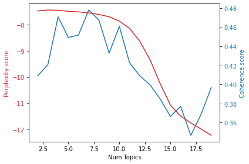

# TOPIC MODELING


```python
import numpy as np
import pandas as pd 
import re 
import gensim 
import json
import timeit
import networkx as nx
import matplotlib.pyplot as plt
import os
import sys
import pyLDAvis
import pyLDAvis.gensim

from gensim import corpora
from gensim import models
from gensim.models.coherencemodel import CoherenceModel

print('Python Version: %s' % (sys.version))
%matplotlib inline
```

    In C:\Users\carlo\Anaconda3\lib\site-packages\matplotlib\mpl-data\stylelib\_classic_test.mplstyle: 
    The text.latex.preview rcparam was deprecated in Matplotlib 3.3 and will be removed two minor releases later.
    In C:\Users\carlo\Anaconda3\lib\site-packages\matplotlib\mpl-data\stylelib\_classic_test.mplstyle: 
    The mathtext.fallback_to_cm rcparam was deprecated in Matplotlib 3.3 and will be removed two minor releases later.
    In C:\Users\carlo\Anaconda3\lib\site-packages\matplotlib\mpl-data\stylelib\_classic_test.mplstyle: Support for setting the 'mathtext.fallback_to_cm' rcParam is deprecated since 3.3 and will be removed two minor releases later; use 'mathtext.fallback : 'cm' instead.
    In C:\Users\carlo\Anaconda3\lib\site-packages\matplotlib\mpl-data\stylelib\_classic_test.mplstyle: 
    The validate_bool_maybe_none function was deprecated in Matplotlib 3.3 and will be removed two minor releases later.
    In C:\Users\carlo\Anaconda3\lib\site-packages\matplotlib\mpl-data\stylelib\_classic_test.mplstyle: 
    The savefig.jpeg_quality rcparam was deprecated in Matplotlib 3.3 and will be removed two minor releases later.
    In C:\Users\carlo\Anaconda3\lib\site-packages\matplotlib\mpl-data\stylelib\_classic_test.mplstyle: 
    The keymap.all_axes rcparam was deprecated in Matplotlib 3.3 and will be removed two minor releases later.
    In C:\Users\carlo\Anaconda3\lib\site-packages\matplotlib\mpl-data\stylelib\_classic_test.mplstyle: 
    The animation.avconv_path rcparam was deprecated in Matplotlib 3.3 and will be removed two minor releases later.
    In C:\Users\carlo\Anaconda3\lib\site-packages\matplotlib\mpl-data\stylelib\_classic_test.mplstyle: 
    The animation.avconv_args rcparam was deprecated in Matplotlib 3.3 and will be removed two minor releases later.
    C:\Users\carlo\Anaconda3\lib\site-packages\past\types\oldstr.py:5: DeprecationWarning: Using or importing the ABCs from 'collections' instead of from 'collections.abc' is deprecated, and in 3.8 it will stop working
      from collections import Iterable
    C:\Users\carlo\Anaconda3\lib\site-packages\past\builtins\misc.py:4: DeprecationWarning: Using or importing the ABCs from 'collections' instead of from 'collections.abc' is deprecated, and in 3.8 it will stop working
      from collections import Mapping
    

    Python Version: 3.7.4 (default, Aug  9 2019, 18:34:13) [MSC v.1915 64 bit (AMD64)]
    


```python
brev = pd.read_csv("../../data/gp-q2-clean.csv")
brev.head()
```


<div>
<style scoped>
    .dataframe tbody tr th:only-of-type {
        vertical-align: middle;
    }

    .dataframe tbody tr th {
        vertical-align: top;
    }

    .dataframe thead th {
        text-align: right;
    }
</style>
<table border="1" class="dataframe">
  <thead>
    <tr style="text-align: right;">
      <th></th>
      <th>code</th>
      <th>title</th>
      <th>pub_date</th>
      <th>citations</th>
      <th>abstract</th>
      <th>class</th>
      <th>year</th>
    </tr>
  </thead>
  <tbody>
    <tr>
      <td>0</td>
      <td>US8370262B2</td>
      <td>System and method for performing secure online...</td>
      <td>2013-02-05</td>
      <td>['US10681025B2', 'CN106664208B', 'AU2012261635...</td>
      <td>\nThe system and method performing secure onli...</td>
      <td>G06</td>
      <td>2013</td>
    </tr>
    <tr>
      <td>1</td>
      <td>US10237070B2</td>
      <td>System and method for sharing keys across auth...</td>
      <td>2019-03-19</td>
      <td>['US10268809B2', 'JP6538821B2', 'KR101721032B1...</td>
      <td>\nA system, apparatus, method, and machine rea...</td>
      <td>H04</td>
      <td>2019</td>
    </tr>
    <tr>
      <td>2</td>
      <td>US10637853B2</td>
      <td>Authentication techniques including speech and...</td>
      <td>2020-04-28</td>
      <td>['US10706421B2', 'US20160269411A1', 'US1021258...</td>
      <td>\nA system, apparatus, method, and machine rea...</td>
      <td>H04</td>
      <td>2020</td>
    </tr>
    <tr>
      <td>3</td>
      <td>US10558974B2</td>
      <td>Methods and systems of providing verification ...</td>
      <td>2020-02-11</td>
      <td>['US20190149537A1', 'US20180308098A1', 'US2018...</td>
      <td>\nA method and system of providing verificatio...</td>
      <td>G06</td>
      <td>2020</td>
    </tr>
    <tr>
      <td>4</td>
      <td>US10769635B2</td>
      <td>Authentication techniques including speech and...</td>
      <td>2020-09-08</td>
      <td>['US9531710B2', 'US10706421B2', 'US20160269411...</td>
      <td>\nA system, apparatus, method, and machine rea...</td>
      <td>G06</td>
      <td>2020</td>
    </tr>
  </tbody>
</table>
</div>


```python
scop = pd.read_csv("../../data/scopus-q2-clean.csv")
scop.head()
```


<div>
<style scoped>
    .dataframe tbody tr th:only-of-type {
        vertical-align: middle;
    }

    .dataframe tbody tr th {
        vertical-align: top;
    }

    .dataframe thead th {
        text-align: right;
    }
</style>
<table border="1" class="dataframe">
  <thead>
    <tr style="text-align: right;">
      <th></th>
      <th>code</th>
      <th>title</th>
      <th>year</th>
      <th>link</th>
      <th>abstract</th>
      <th>keyword</th>
    </tr>
  </thead>
  <tbody>
    <tr>
      <td>0</td>
      <td>85062908267</td>
      <td>Terrorist network analysis and identification ...</td>
      <td>2018</td>
      <td>https://www.scopus.com/inward/record.uri?eid=2...</td>
      <td>The prediction of terrorist network and identi...</td>
      <td>Internet of things; Learning algorithms; Smart...</td>
    </tr>
    <tr>
      <td>1</td>
      <td>85092037876</td>
      <td>Who makes revolution in the age of speculative...</td>
      <td>2018</td>
      <td>https://www.scopus.com/inward/record.uri?eid=2...</td>
      <td>Contemporary theories of social emancipation c...</td>
      <td>NaN</td>
    </tr>
    <tr>
      <td>2</td>
      <td>85061535070</td>
      <td>One-shot learning approach for unknown malware...</td>
      <td>2018</td>
      <td>https://www.scopus.com/inward/record.uri?eid=2...</td>
      <td>Early detection of new kinds of malware always...</td>
      <td>Character recognition; Classification (of info...</td>
    </tr>
    <tr>
      <td>3</td>
      <td>85055699089</td>
      <td>Regulating Artificial Intelligence Proposal fo...</td>
      <td>2018</td>
      <td>https://www.scopus.com/inward/record.uri?eid=2...</td>
      <td>Given the ubiquity of artificial intelligence ...</td>
      <td>Autonomous vehicles; International trade; Pers...</td>
    </tr>
    <tr>
      <td>4</td>
      <td>85061405847</td>
      <td>Defending Against Adversarial Samples Without ...</td>
      <td>2018</td>
      <td>https://www.scopus.com/inward/record.uri?eid=2...</td>
      <td>It has been recently shown that deep neural ne...</td>
      <td>Computer crime; Data mining; Deep neural netwo...</td>
    </tr>
  </tbody>
</table>
</div>


## TEXT PREPROCESSING


```python
# Load the regular expression library
import re# Remove punctuation
brev['abstract_processed'] = brev['abstract'].map(lambda x: re.sub('[,\.!?]', '', x))# Convert the titles to lowercase
brev['abstract_processed'] = brev['abstract_processed'].map(lambda x: x.lower())# Print out the first rows of papers
brev['abstract'].head()
```

    <>:3: DeprecationWarning: invalid escape sequence \.
    <>:3: DeprecationWarning: invalid escape sequence \.
    <>:3: DeprecationWarning: invalid escape sequence \.
    <ipython-input-6-b8811669afc8>:3: DeprecationWarning: invalid escape sequence \.
      brev['abstract_processed'] = brev['abstract'].map(lambda x: re.sub('[,\.!?]', '', x))# Convert the titles to lowercase
    


    0    \nThe system and method performing secure onli...
    1    \nA system, apparatus, method, and machine rea...
    2    \nA system, apparatus, method, and machine rea...
    3    \nA method and system of providing verificatio...
    4    \nA system, apparatus, method, and machine rea...
    Name: abstract, dtype: object


```python
import gensim
from gensim.utils import simple_preprocess
def sent_to_words(sentences):
    for sentence in sentences:
        yield(gensim.utils.simple_preprocess(str(sentence), deacc=True))  # deacc=True removes punctuations
data = brev.abstract_processed.values.tolist()
data_words = list(sent_to_words(data))
print(data_words[:1][0][:30])
```

    ['the', 'system', 'and', 'method', 'performing', 'secure', 'online', 'transactions', 'based', 'on', 'challenge', 'response', 'procedures', 'executed', 'by', 'terminal', 'of', 'at', 'least', 'one', 'customer', 'and', 'by', 'terminal', 'of', 'service', 'provider', 'such', 'as', 'bank']
    


```python
# Build the bigram and trigram models
bigram = gensim.models.Phrases(data_words, min_count=5, threshold=100) # higher threshold fewer phrases.
trigram = gensim.models.Phrases(bigram[data_words], threshold=100)# Faster way to get a sentence clubbed as a trigram/bigram
bigram_mod = gensim.models.phrases.Phraser(bigram)
trigram_mod = gensim.models.phrases.Phraser(trigram)
```


```python
# NLTK Stop words
# import nltk
# nltk.download('stopwords')
from nltk.corpus import stopwords
stop_words = stopwords.words('english')
stop_words.extend(['from', 'subject', 're', 'edu', 'use'])# Define functions for stopwords, bigrams, trigrams and lemmatization
def remove_stopwords(texts):
    return [[word for word in simple_preprocess(str(doc))
             if word not in stop_words] for doc in texts]
def make_bigrams(texts):
    return [bigram_mod[doc] for doc in texts]
def make_trigrams(texts):
    return [trigram_mod[bigram_mod[doc]] for doc in texts]
def lemmatization(texts, allowed_postags=['NOUN', 'ADJ', 'VERB', 'ADV']):
    """https://spacy.io/api/annotation"""
    texts_out = []
    for sent in texts:
        doc = nlp(" ".join(sent)) 
        texts_out.append([token.lemma_ for token in doc if token.pos_ in allowed_postags])
    return texts_out
```

    C:\Users\carlo\Anaconda3\lib\site-packages\nltk\decorators.py:68: DeprecationWarning: `formatargspec` is deprecated since Python 3.5. Use `signature` and the `Signature` object directly
      regargs, varargs, varkwargs, defaults, formatvalue=lambda value: ""
    C:\Users\carlo\Anaconda3\lib\site-packages\nltk\lm\counter.py:15: DeprecationWarning: Using or importing the ABCs from 'collections' instead of from 'collections.abc' is deprecated, and in 3.8 it will stop working
      from collections import Sequence, defaultdict
    


```python
import spacy# Remove Stop Words
data_words_nostops = remove_stopwords(data_words)# Form Bigrams
data_words_bigrams = make_bigrams(data_words_nostops)# Initialize spacy 'en' model, keeping only tagger component (for efficiency)
data_lemmatized = data_words_bigrams #in realtà è senza lemmatiazion perchè ci dà problemi
```


```python
import gensim.corpora as corpora# Create Dictionary
id2word = corpora.Dictionary(data_lemmatized)# Create Corpus
texts = data_lemmatized# Term Document Frequency
corpus = [id2word.doc2bow(text) for text in texts]# View
print(corpus[:1])
```

    [[(0, 1), (1, 1), (2, 1), (3, 1), (4, 1), (5, 1), (6, 1), (7, 2), (8, 7), (9, 2), (10, 4), (11, 1), (12, 1), (13, 1), (14, 1), (15, 6), (16, 8), (17, 1), (18, 1), (19, 3), (20, 1), (21, 1), (22, 1), (23, 1), (24, 1), (25, 1), (26, 1), (27, 1), (28, 1), (29, 1), (30, 2), (31, 1), (32, 1), (33, 1), (34, 2), (35, 2), (36, 1), (37, 1), (38, 2), (39, 1), (40, 4), (41, 1), (42, 1), (43, 6), (44, 1), (45, 1), (46, 1), (47, 1), (48, 4), (49, 1), (50, 1), (51, 1), (52, 6), (53, 1), (54, 1), (55, 4), (56, 1), (57, 1)]]
    

# Optimal number of topics ? 


```python
def compute_performance(dictionary, corpus, texts, limit, start=2, step=1):
    """
    Compute c_v coherence and perplexity for various number of topics

    Parameters:
    ----------
    dictionary : Gensim dictionary
    corpus : Gensim corpus
    texts : List of input texts
    limit : Max num of topics

    Returns:
    -------
    model_list : List of LDA topic models
    coherence_values : Coherence values corresponding to the LDA model with respective number of topics
    perplexity_values : Perplexity values corresponding to the LDA model with respective number of topics
    """
    coherence_values = []
    model_list = []
    perplexity_values = []
    for num_topics in range(start, limit, step):
        model = gensim.models.ldamodel.LdaModel(corpus=corpus,
                                                num_topics=num_topics, 
                                                id2word=dictionary,
                                                random_state=100,
                                                update_every=1,
                                                chunksize=100,
                                                passes=10,
                                                alpha='auto',
                                                per_word_topics=True)
        model_list.append(model)
        coherencemodel = CoherenceModel(model=model, texts=texts, dictionary=dictionary, coherence='c_v')
        coherence_values.append(coherencemodel.get_coherence())
        perplexity = model.log_perplexity(corpus)
        perplexity_values.append(perplexity)

    return model_list, coherence_values, perplexity_values
```


```python
model_list, coherence_values, perplexity_values = compute_performance(dictionary=id2word, 
                                                        corpus=corpus, 
                                                        texts=data_lemmatized, #dovremmo lemmatizzare
                                                        start=2, limit=20, step=1)
```


```python


# Show graph
limit=20; start=2; step=1;
x = range(start, limit, step)
fig, ax1 = plt.subplots()
color = 'tab:red'
plt.xlabel("Num Topics")
plt.ylabel("Perplexity score", color=color)
ax1.plot(x, perplexity_values, color=color)
ax1.tick_params(axis='y', labelcolor=color)

ax2 = ax1.twinx() # instantiate a second axes that shares the same x-axis
color = 'tab:blue'
ax2.set_ylabel('Coherence score', color=color)  # we already handled the x-label with ax1
ax2.plot(x, coherence_values, color=color)
ax2.tick_params(axis='y', labelcolor=color)

fig.tight_layout()  # otherwise the right y-label is slightly clipped
plt.show()


```





```python
from gensim.models import CoherenceModel# Compute Coherence Score
coherence_model_lda = CoherenceModel(model=lda_model, texts=data_lemmatized, dictionary=id2word, coherence='c_v')
coherence_lda = coherence_model_lda.get_coherence()
print('\nCoherence Score: ', coherence_lda)
```

    
    Coherence Score:  0.44171001013762784
    

## Using 7 topics


```python
lda_model = gensim.models.LdaMulticore(corpus=corpus,
                                       id2word=id2word,
                                       num_topics=7, 
                                       random_state=100,
                                       chunksize=100,
                                       passes=10,
                                       per_word_topics=True)
```


```python
from gensim.models import CoherenceModel# Compute Coherence Score
coherence_model_lda = CoherenceModel(model=lda_model, texts=data_lemmatized, dictionary=id2word, coherence='c_v')
coherence_lda = coherence_model_lda.get_coherence()
print('\nCoherence Score: ', coherence_lda)
```

    
    Coherence Score:  0.48503046908917974
    


```python
lda_model.print_topics()
```


    [(0,
      '0.026*"model" + 0.024*"malicious" + 0.021*"detection" + 0.018*"behavior" + 0.018*"based" + 0.016*"learning" + 0.015*"feature" + 0.015*"network" + 0.014*"set" + 0.014*"attack"'),
     (1,
      '0.077*"user" + 0.043*"content" + 0.012*"mobile" + 0.012*"based" + 0.012*"information" + 0.011*"display" + 0.010*"media" + 0.010*"search" + 0.010*"input" + 0.010*"users"'),
     (2,
      '0.085*"data" + 0.034*"one" + 0.023*"network" + 0.020*"system" + 0.016*"least" + 0.015*"plurality" + 0.015*"event" + 0.013*"based" + 0.012*"traffic" + 0.009*"node"'),
     (3,
      '0.023*"information" + 0.022*"invention" + 0.020*"data" + 0.017*"method" + 0.014*"system" + 0.013*"module" + 0.013*"unit" + 0.012*"according" + 0.011*"image" + 0.010*"present"'),
     (4,
      '0.030*"computer" + 0.027*"file" + 0.026*"application" + 0.023*"computing" + 0.022*"may" + 0.020*"device" + 0.020*"method" + 0.016*"data" + 0.015*"disclosed" + 0.015*"include"'),
     (5,
      '0.032*"device" + 0.025*"security" + 0.024*"network" + 0.022*"information" + 0.022*"system" + 0.019*"user" + 0.015*"service" + 0.013*"server" + 0.010*"communication" + 0.010*"based"'),
     (6,
      '0.096*"first" + 0.058*"second" + 0.024*"message" + 0.020*"set" + 0.014*"one" + 0.012*"value" + 0.011*"includes" + 0.011*"method" + 0.010*"plurality" + 0.009*"domain_name"')]


### Saving a web dashboard
The pyLDAvis library provides a cool interactive dashboard to visualize the topics found.
[See here the seven topics.](https://topicmodeling.000webhostapp.com/topics.html)


```python
import pyLDAvis.gensim
import pickle 
import pyLDAvis# Visualize the topics
pyLDAvis.enable_notebook()
LDAvis_prepared = pyLDAvis.gensim.prepare(lda_model, corpus, id2word)
LDAvis_prepared

from spacy.lang.en import English
```

    C:\Users\carlo\Anaconda3\lib\site-packages\pyLDAvis\_prepare.py:257: FutureWarning: Sorting because non-concatenation axis is not aligned. A future version
    of pandas will change to not sort by default.
    
    To accept the future behavior, pass 'sort=False'.
    
    To retain the current behavior and silence the warning, pass 'sort=True'.
    
      return pd.concat([default_term_info] + list(topic_dfs))
    


```python
pyLDAvis.display(LDAvis_prepared)
```


<link rel="stylesheet" type="text/css" href="https://cdn.rawgit.com/bmabey/pyLDAvis/files/ldavis.v1.0.0.css">


<div id="ldavis_el238024246775990482872750355"></div>
<script type="text/javascript">

var ldavis_el238024246775990482872750355_data = {"mdsDat": {"x": [-0.17644962324484856, -0.08422835019802088, -0.007116789103164947, -0.04515765568050846, 0.07970247433591808, -0.07211927596485718, 0.3053692198554818], "y": [-0.08624492385709821, 0.22733294859603656, -0.00014665209903018622, -0.08846146274485543, 0.193158407283951, -0.15775160795743928, -0.0878867092215645], "topics": [1, 2, 3, 4, 5, 6, 7], "cluster": [1, 1, 1, 1, 1, 1, 1], "Freq": [20.530384063720703, 18.910350799560547, 16.446279525756836, 14.676102638244629, 13.284720420837402, 9.073808670043945, 7.078357696533203]}, "tinfo": {"Category": ["Default", "Default", "Default", "Default", "Default", "Default", "Default", "Default", "Default", "Default", "Default", "Default", "Default", "Default", "Default", "Default", "Default", "Default", "Default", "Default", "Default", "Default", "Default", "Default", "Default", "Default", "Default", "Default", "Default", "Default", "Topic1", "Topic1", "Topic1", "Topic1", "Topic1", "Topic1", "Topic1", "Topic1", "Topic1", "Topic1", "Topic1", "Topic1", "Topic1", "Topic1", "Topic1", "Topic1", "Topic1", "Topic1", "Topic1", "Topic1", "Topic1", "Topic1", "Topic1", "Topic1", "Topic1", "Topic1", "Topic1", "Topic1", "Topic1", "Topic1", "Topic1", "Topic1", "Topic1", "Topic1", "Topic1", "Topic1", "Topic1", "Topic1", "Topic1", "Topic1", "Topic1", "Topic1", "Topic1", "Topic1", "Topic1", "Topic1", "Topic1", "Topic1", "Topic1", "Topic1", "Topic1", "Topic1", "Topic1", "Topic1", "Topic1", "Topic1", "Topic1", "Topic1", "Topic1", "Topic1", "Topic1", "Topic1", "Topic1", "Topic1", "Topic1", "Topic1", "Topic1", "Topic1", "Topic1", "Topic2", "Topic2", "Topic2", "Topic2", "Topic2", "Topic2", "Topic2", "Topic2", "Topic2", "Topic2", "Topic2", "Topic2", "Topic2", "Topic2", "Topic2", "Topic2", "Topic2", "Topic2", "Topic2", "Topic2", "Topic2", "Topic2", "Topic2", "Topic2", "Topic2", "Topic2", "Topic2", "Topic2", "Topic2", "Topic2", "Topic2", "Topic2", "Topic2", "Topic2", "Topic2", "Topic2", "Topic2", "Topic2", "Topic2", "Topic2", "Topic2", "Topic2", "Topic2", "Topic2", "Topic2", "Topic2", "Topic2", "Topic2", "Topic2", "Topic2", "Topic2", "Topic2", "Topic2", "Topic2", "Topic2", "Topic2", "Topic2", "Topic2", "Topic2", "Topic2", "Topic2", "Topic2", "Topic2", "Topic2", "Topic3", "Topic3", "Topic3", "Topic3", "Topic3", "Topic3", "Topic3", "Topic3", "Topic3", "Topic3", "Topic3", "Topic3", "Topic3", "Topic3", "Topic3", "Topic3", "Topic3", "Topic3", "Topic3", "Topic3", "Topic3", "Topic3", "Topic3", "Topic3", "Topic3", "Topic3", "Topic3", "Topic3", "Topic3", "Topic3", "Topic3", "Topic3", "Topic3", "Topic3", "Topic3", "Topic3", "Topic3", "Topic3", "Topic3", "Topic3", "Topic3", "Topic3", "Topic3", "Topic3", "Topic3", "Topic3", "Topic3", "Topic3", "Topic3", "Topic3", "Topic3", "Topic3", "Topic3", "Topic3", "Topic3", "Topic3", "Topic3", "Topic3", "Topic3", "Topic3", "Topic3", "Topic3", "Topic3", "Topic3", "Topic3", "Topic3", "Topic3", "Topic3", "Topic3", "Topic3", "Topic3", "Topic4", "Topic4", "Topic4", "Topic4", "Topic4", "Topic4", "Topic4", "Topic4", "Topic4", "Topic4", "Topic4", "Topic4", "Topic4", "Topic4", "Topic4", "Topic4", "Topic4", "Topic4", "Topic4", "Topic4", "Topic4", "Topic4", "Topic4", "Topic4", "Topic4", "Topic4", "Topic4", "Topic4", "Topic4", "Topic4", "Topic4", "Topic4", "Topic4", "Topic4", "Topic4", "Topic4", "Topic4", "Topic4", "Topic4", "Topic4", "Topic4", "Topic4", "Topic4", "Topic4", "Topic4", "Topic4", "Topic4", "Topic4", "Topic4", "Topic4", "Topic4", "Topic4", "Topic4", "Topic4", "Topic4", "Topic4", "Topic4", "Topic4", "Topic4", "Topic4", "Topic4", "Topic4", "Topic4", "Topic4", "Topic4", "Topic4", "Topic4", "Topic4", "Topic5", "Topic5", "Topic5", "Topic5", "Topic5", "Topic5", "Topic5", "Topic5", "Topic5", "Topic5", "Topic5", "Topic5", "Topic5", "Topic5", "Topic5", "Topic5", "Topic5", "Topic5", "Topic5", "Topic5", "Topic5", "Topic5", "Topic5", "Topic5", "Topic5", "Topic5", "Topic5", "Topic5", "Topic5", "Topic5", "Topic5", "Topic5", "Topic5", "Topic5", "Topic5", "Topic5", "Topic5", "Topic5", "Topic5", "Topic5", "Topic5", "Topic5", "Topic5", "Topic5", "Topic5", "Topic5", "Topic5", "Topic5", "Topic5", "Topic5", "Topic5", "Topic5", "Topic5", "Topic5", "Topic5", "Topic5", "Topic5", "Topic5", "Topic5", "Topic5", "Topic5", "Topic5", "Topic6", "Topic6", "Topic6", "Topic6", "Topic6", "Topic6", "Topic6", "Topic6", "Topic6", "Topic6", "Topic6", "Topic6", "Topic6", "Topic6", "Topic6", "Topic6", "Topic6", "Topic6", "Topic6", "Topic6", "Topic6", "Topic6", "Topic6", "Topic6", "Topic6", "Topic6", "Topic6", "Topic6", "Topic6", "Topic6", "Topic6", "Topic6", "Topic6", "Topic6", "Topic6", "Topic6", "Topic6", "Topic6", "Topic6", "Topic6", "Topic6", "Topic6", "Topic6", "Topic6", "Topic6", "Topic6", "Topic6", "Topic6", "Topic6", "Topic6", "Topic6", "Topic6", "Topic6", "Topic6", "Topic6", "Topic6", "Topic6", "Topic6", "Topic6", "Topic6", "Topic6", "Topic6", "Topic6", "Topic6", "Topic6", "Topic6", "Topic7", "Topic7", "Topic7", "Topic7", "Topic7", "Topic7", "Topic7", "Topic7", "Topic7", "Topic7", "Topic7", "Topic7", "Topic7", "Topic7", "Topic7", "Topic7", "Topic7", "Topic7", "Topic7", "Topic7", "Topic7", "Topic7", "Topic7", "Topic7", "Topic7", "Topic7", "Topic7", "Topic7", "Topic7", "Topic7", "Topic7", "Topic7", "Topic7", "Topic7", "Topic7", "Topic7", "Topic7", "Topic7", "Topic7", "Topic7", "Topic7", "Topic7", "Topic7", "Topic7", "Topic7", "Topic7", "Topic7", "Topic7", "Topic7", "Topic7", "Topic7", "Topic7", "Topic7", "Topic7", "Topic7", "Topic7", "Topic7", "Topic7", "Topic7", "Topic7", "Topic7"], "Freq": [7839.0, 4950.0, 15394.0, 2958.0, 2835.0, 2907.0, 2842.0, 7956.0, 2523.0, 7918.0, 4214.0, 2769.0, 3756.0, 3409.0, 8485.0, 5340.0, 3157.0, 1779.0, 3377.0, 1312.0, 1533.0, 2323.0, 8030.0, 4944.0, 1552.0, 4119.0, 1799.0, 1416.0, 1931.0, 1425.0, 778.6740112304688, 505.61846923828125, 481.7369689941406, 445.3666076660156, 396.0144348144531, 364.65673828125, 308.8681640625, 291.92742919921875, 251.1219940185547, 223.24099731445312, 198.19996643066406, 187.09469604492188, 181.13182067871094, 166.53225708007812, 1390.5145263671875, 144.23007202148438, 136.86134338378906, 136.50343322753906, 131.5301513671875, 245.09207153320312, 122.24246215820312, 121.85015106201172, 115.8298110961914, 109.24159240722656, 99.5910415649414, 99.47077941894531, 99.03453826904297, 94.24636840820312, 93.57463836669922, 93.25656127929688, 2207.142333984375, 296.0724792480469, 308.0478515625, 209.4763641357422, 520.8118896484375, 278.2732849121094, 209.61154174804688, 2010.05908203125, 1054.40576171875, 641.9255981445312, 3676.106689453125, 1320.0965576171875, 273.411865234375, 706.6121215820312, 4713.96875, 1378.309814453125, 1451.464111328125, 417.7877197265625, 1047.5452880859375, 3607.032958984375, 3349.118408203125, 525.1373901367188, 1025.974365234375, 3227.068603515625, 2779.138916015625, 904.1920776367188, 724.9412231445312, 436.73724365234375, 1430.4241943359375, 610.5242309570312, 1026.232177734375, 561.9290161132812, 682.310302734375, 661.6807861328125, 794.4552612304688, 626.5689086914062, 545.7752685546875, 539.245849609375, 541.05224609375, 763.8541259765625, 579.9737548828125, 467.2405700683594, 454.5082092285156, 437.6367492675781, 380.67041015625, 347.5787658691406, 343.9189147949219, 325.17572021484375, 291.8360595703125, 273.97222900390625, 259.0080871582031, 228.3603057861328, 215.0142059326172, 202.7572021484375, 186.41781616210938, 185.75218200683594, 165.7979736328125, 156.06488037109375, 154.92703247070312, 153.72735595703125, 153.42298889160156, 150.93980407714844, 146.27386474609375, 141.4414825439453, 140.3648223876953, 138.2721710205078, 132.65419006347656, 128.23760986328125, 128.01882934570312, 1450.06884765625, 389.2759094238281, 979.452880859375, 1841.58349609375, 3008.631103515625, 501.69476318359375, 1298.409423828125, 570.9021606445312, 1842.2322998046875, 475.53729248046875, 1627.0166015625, 476.1385192871094, 765.0521240234375, 386.5694580078125, 332.2955017089844, 1322.9873046875, 1146.1087646484375, 1062.82568359375, 1248.0220947265625, 3102.704833984375, 753.2666625976562, 2397.182861328125, 607.6217651367188, 2713.4619140625, 660.6751098632812, 1856.8929443359375, 770.3797607421875, 845.9920043945312, 755.7877197265625, 949.7561645507812, 666.938720703125, 777.9888916015625, 774.2857666015625, 544.8140869140625, 1115.3905029296875, 819.979248046875, 787.7457885742188, 1424.0584716796875, 245.5736846923828, 198.5167694091797, 152.83013916015625, 140.65438842773438, 119.04185485839844, 113.39849853515625, 91.54306030273438, 92.82722473144531, 89.15171813964844, 89.24625396728516, 82.8538818359375, 80.01676177978516, 75.46513366699219, 74.72452545166016, 73.30876159667969, 73.06385803222656, 72.29470825195312, 71.11369323730469, 70.83515930175781, 70.65557098388672, 69.29659271240234, 67.30390167236328, 66.32772827148438, 63.65358352661133, 61.60970687866211, 60.95614242553711, 872.1585083007812, 1740.37109375, 369.439697265625, 201.5678253173828, 355.47412109375, 667.5996704101562, 321.864013671875, 135.4272918701172, 286.8378601074219, 10202.052734375, 557.4135131835938, 310.33612060546875, 639.2763061523438, 242.76333618164062, 227.97393798828125, 296.3131103515625, 651.3442993164062, 467.25030517578125, 4075.60693359375, 978.4988403320312, 1744.957763671875, 737.6194458007812, 565.1224365234375, 1953.4071044921875, 2721.20849609375, 1040.37890625, 376.48797607421875, 2351.20068359375, 1014.5213623046875, 499.66534423828125, 1082.54052734375, 1545.760009765625, 495.12103271484375, 1062.75830078125, 463.49420166015625, 537.2479858398438, 594.830078125, 554.1021728515625, 614.4032592773438, 554.0379028320312, 507.30938720703125, 691.1015014648438, 310.8827209472656, 194.82789611816406, 177.85511779785156, 172.4814910888672, 122.10914611816406, 375.88922119140625, 112.0694351196289, 105.2176284790039, 99.15574645996094, 94.02013397216797, 2881.62255859375, 78.73916625976562, 75.91544342041016, 75.04466247558594, 73.8318862915039, 75.04090881347656, 69.41968536376953, 64.41212463378906, 64.41222381591797, 713.405029296875, 62.8842887878418, 62.523433685302734, 61.18973159790039, 60.67667007446289, 60.08356857299805, 63.33583450317383, 59.455902099609375, 57.76521301269531, 57.029842376708984, 1103.2335205078125, 223.13671875, 227.6228485107422, 592.2440795898438, 2453.938232421875, 378.2301025390625, 290.8633117675781, 3156.15869140625, 2729.364990234375, 164.329833984375, 1628.2177734375, 843.265869140625, 1068.9742431640625, 330.94720458984375, 1592.7447509765625, 698.0429077148438, 287.9556884765625, 278.4759826660156, 1302.743408203125, 824.9570922851562, 1046.604736328125, 1311.038818359375, 1413.629638671875, 2319.850830078125, 742.2360229492188, 751.2957763671875, 842.0887451171875, 636.1649169921875, 2136.076904296875, 2182.566650390625, 1316.0206298828125, 681.5023803710938, 1554.3900146484375, 700.9198608398438, 1110.5059814453125, 1652.9849853515625, 1200.537109375, 910.2680053710938, 1778.8336181640625, 1532.6654052734375, 1185.982666015625, 900.3799438476562, 400.1003723144531, 370.18609619140625, 359.14666748046875, 307.24798583984375, 294.6529541015625, 775.18212890625, 236.8171844482422, 234.3896026611328, 220.12318420410156, 319.6274108886719, 197.76654052734375, 171.37191772460938, 125.40406799316406, 112.40251922607422, 112.8272705078125, 111.27000427246094, 110.53412628173828, 108.67092895507812, 102.48986053466797, 102.9705810546875, 98.60253143310547, 94.01390838623047, 88.21038818359375, 84.08280181884766, 78.50373840332031, 93.58672332763672, 959.1836547851562, 1162.0665283203125, 1369.449462890625, 1476.866943359375, 175.8430938720703, 2306.220703125, 577.8419189453125, 2509.313232421875, 409.17474365234375, 325.18756103515625, 708.12158203125, 341.0169372558594, 202.06715393066406, 268.4868469238281, 2001.8023681640625, 923.7284545898438, 1111.825439453125, 575.0552978515625, 998.3887939453125, 1378.9481201171875, 587.5432739257812, 1773.7490234375, 977.2889404296875, 1432.234130859375, 437.27398681640625, 720.9309692382812, 1255.0517578125, 691.8355712890625, 523.4102783203125, 501.0354309082031, 456.3030090332031, 546.8876342773438, 2834.90673828125, 459.6827087402344, 380.8343505859375, 284.5617980957031, 223.70188903808594, 191.2504425048828, 179.5755615234375, 170.3269500732422, 159.58668518066406, 153.2503204345703, 141.53846740722656, 137.39895629882812, 128.64761352539062, 76.45230102539062, 73.3878173828125, 71.0462417602539, 69.74317169189453, 69.02855682373047, 67.55538940429688, 63.865047454833984, 123.80269622802734, 60.45911407470703, 58.36940383911133, 56.827239990234375, 56.25098419189453, 56.09470748901367, 55.08932113647461, 54.2586669921875, 53.879329681396484, 53.25868225097656, 279.1708068847656, 477.9764709472656, 240.12957763671875, 673.86669921875, 547.444580078125, 252.85525512695312, 217.01405334472656, 316.2911376953125, 327.003662109375, 708.1710815429688, 127.83968353271484, 5050.40478515625, 191.02163696289062, 84.23635864257812, 661.0820922851562, 200.9226837158203, 644.4321899414062, 808.8175659179688, 574.724853515625, 650.9494018554688, 240.56381225585938, 430.1513977050781, 210.2292938232422, 807.376708984375, 765.675537109375, 314.44903564453125, 642.8123168945312, 611.6449584960938, 586.587158203125, 409.27569580078125, 440.7463684082031, 351.1702880859375, 469.0316162109375, 315.73175048828125, 342.0147399902344, 293.95294189453125, 4949.65673828125, 2957.94189453125, 441.3248291015625, 391.4093933105469, 232.2784881591797, 217.31739807128906, 195.00830078125, 179.56503295898438, 176.8618927001953, 165.7669219970703, 392.4008483886719, 152.1366729736328, 131.1220703125, 125.8069076538086, 120.13091278076172, 107.52056121826172, 100.81983947753906, 99.45309448242188, 90.60392761230469, 87.07865142822266, 81.10851287841797, 79.20252990722656, 77.54055786132812, 74.49974060058594, 72.76261901855469, 68.4944076538086, 68.48405456542969, 62.28577423095703, 62.03888702392578, 59.42316818237305, 318.7814025878906, 126.85289764404297, 102.2212905883789, 1210.2388916015625, 156.07077026367188, 153.48345947265625, 127.19888305664062, 255.84933471679688, 223.25486755371094, 635.8416748046875, 1008.4573364257812, 144.18870544433594, 248.0104522705078, 209.7904510498047, 260.52557373046875, 570.2644653320312, 522.8235473632812, 721.7576904296875, 204.90908813476562, 565.4081420898438, 321.66229248046875, 301.2680358886719, 377.57843017578125, 299.42864990234375, 258.1004333496094, 332.2884216308594, 241.32061767578125, 233.62823486328125, 244.2937774658203, 262.0802307128906, 212.06256103515625], "Term": ["user", "first", "data", "second", "content", "file", "model", "network", "malicious", "one", "computer", "computing", "application", "invention", "device", "security", "detection", "behavior", "set", "message", "learning", "service", "information", "may", "feature", "least", "event", "attack", "unit", "traffic", "transaction", "blockchain", "services", "payment", "enterprise", "iot", "infrastructure", "transactions", "biometric", "credentials", "cryptocurrency", "voting", "gateway", "authorization", "authentication", "things", "consumer", "peer", "proxy", "customer", "question", "vulnerabilities", "participant", "merchant", "master", "switching", "answer", "inquiry", "routing", "smart_contract", "service", "card", "token", "exchange", "identity", "id", "trust", "server", "risk", "wireless", "security", "devices", "personal", "cloud", "device", "access", "communication", "asset", "management", "network", "information", "internet", "request", "system", "user", "client", "electronic", "secure", "based", "platform", "may", "providing", "includes", "using", "one", "systems", "response", "provided", "method", "safety", "discloses", "following_steps", "kind", "preset", "acquisition", "efficiency", "carried", "big", "discloses_kind", "problem", "camera", "judging", "picture", "face", "technical_field", "robot", "carry", "carrying", "carries", "realize", "emergency", "driving", "accurate", "drone", "body", "station", "early_warning", "personnel", "design", "image", "acquiring", "equipment", "unit", "invention", "recognition", "terminal", "means", "module", "step", "according", "intelligent", "relates", "mode", "position", "present", "comprises", "target", "control", "information", "vehicle", "method", "identification", "data", "result", "system", "monitoring", "processing", "code", "detection", "operation", "analysis", "time", "provides", "node", "nodes", "packet", "traffic", "packets", "game", "segment", "flows", "bus", "unmanned_aerial", "weights", "drawing_figure", "structured", "embedding", "patient", "housing", "ha", "microprocessor", "trace", "edges", "programmable", "regular_expression", "tcam", "tier", "campaign", "rf", "cell", "auxiliary", "streams", "insurance", "events", "event", "sensors", "logic", "entities", "query", "stream", "raw", "controller", "data", "engine", "alert", "entity", "signals", "modules", "sources", "sensor", "rules", "one", "configured", "plurality", "processor", "graph", "least", "network", "processing", "respective", "system", "associated", "flow", "includes", "based", "signal", "may", "output", "vehicle", "monitoring", "including", "set", "control", "module", "readable_media", "container", "backup", "iv", "ransomware", "watermark", "executable", "telemetry", "player", "requirement", "untrusted", "file", "infected", "zone", "vm", "disk", "gas", "unencrypted", "parent", "bid", "files", "decrypt", "trustworthiness", "copy", "appliance", "vehicular", "permissions", "child", "movie", "heat", "implemented", "iii", "reputation", "encrypted", "computing", "metadata", "ii", "computer", "application", "attempt", "disclosed", "key", "identifying", "signature", "include", "virtual", "sensitive", "encryption", "determining", "various", "also", "methods", "systems", "may", "within", "program", "code", "object", "method", "device", "least", "process", "one", "client", "security", "data", "system", "based", "behavior", "learning", "training", "vector", "trained", "classifier", "neural", "de", "vectors", "sample", "samples", "behaviors", "un", "api", "sequences", "tree", "et", "benign", "topics", "term", "defect", "train", "classifiers", "predictive", "weighted", "frequent", "dispos_dans", "symbols", "learned", "predict", "features", "classification", "attack", "feature", "temporal", "malicious", "call", "model", "prediction", "probability", "sequence", "models", "clustering", "behavioral", "detection", "malware", "software", "characteristics", "machine", "set", "detected", "based", "using", "network", "algorithm", "analysis", "method", "time", "detecting", "value", "score", "device", "content", "item", "advertisement", "multimedia", "displayed", "graphical", "viewer", "recommendation", "advertising", "web_page", "presentation", "playing", "contact", "lock", "displays", "click", "web_browser", "viewing", "marketing", "scm", "touch", "lbt_type", "sentiment", "exposure", "watching", "option", "operators", "predictions", "geographical", "db", "items", "website", "page", "media", "social", "webpage", "interest", "audio", "online", "display", "modification", "user", "interactive", "trend", "search", "interactions", "users", "mobile", "video", "input", "interaction", "interface", "facility", "based", "information", "selected", "method", "one", "device", "associated", "may", "communication", "system", "provided", "least", "receiving", "first", "second", "domain_name", "document", "documents", "der", "table", "third", "dns", "und", "candidate", "die", "string", "einer", "count", "ein", "von", "icon", "das", "eine", "robotic", "domain_names", "ist", "spam", "definition", "einen", "zu", "werden", "manages", "strings", "domain", "mail", "sender", "message", "section", "language", "domains", "messages", "hash", "value", "set", "words", "block", "list", "group", "includes", "plurality", "one", "attribute", "method", "corresponding", "receiving", "least", "associated", "wherein", "based", "electronic", "generating", "determining", "information", "determined"], "Total": [7839.0, 4950.0, 15394.0, 2958.0, 2835.0, 2907.0, 2842.0, 7956.0, 2523.0, 7918.0, 4214.0, 2769.0, 3756.0, 3409.0, 8485.0, 5340.0, 3157.0, 1779.0, 3377.0, 1312.0, 1533.0, 2323.0, 8030.0, 4944.0, 1552.0, 4119.0, 1799.0, 1416.0, 1931.0, 1425.0, 779.5120849609375, 506.45819091796875, 482.575439453125, 446.204833984375, 396.85394287109375, 365.4949951171875, 309.7085266113281, 292.7662353515625, 252.02679443359375, 224.08090209960938, 199.03805541992188, 187.9338836669922, 181.9703826904297, 167.37066650390625, 1398.3612060546875, 145.07102966308594, 137.70269775390625, 137.34951782226562, 132.36904907226562, 246.7689666748047, 123.08467102050781, 122.69127655029297, 116.6704330444336, 110.0791015625, 100.43215942382812, 100.31196594238281, 99.90946960449219, 95.09130859375, 94.41364288330078, 94.09469604492188, 2323.6103515625, 304.2469482421875, 318.17889404296875, 216.272705078125, 553.6923217773438, 291.1604919433594, 217.2918701171875, 2530.018798828125, 1297.5335693359375, 762.8703002929688, 5340.73388671875, 1719.025634765625, 298.5487976074219, 907.6052856445312, 8485.0478515625, 2008.7791748046875, 2233.725830078125, 499.248779296875, 1594.1439208984375, 7956.6328125, 8030.818359375, 720.8233642578125, 1851.427490234375, 9539.2421875, 7839.28662109375, 1637.2860107421875, 1268.450927734375, 569.2073974609375, 7179.65576171875, 1322.8028564453125, 4944.47802734375, 1079.505859375, 3373.173583984375, 3082.075439453125, 7918.1083984375, 2637.484619140625, 1654.892578125, 1782.0469970703125, 8037.9970703125, 764.7138061523438, 580.8331909179688, 468.1019287109375, 455.3670959472656, 438.49755859375, 381.5292663574219, 348.4385986328125, 344.7801208496094, 326.0354919433594, 292.69488525390625, 274.83221435546875, 259.8673400878906, 229.2205810546875, 215.87277221679688, 203.615478515625, 187.27716064453125, 186.61097717285156, 166.6565704345703, 156.9245147705078, 155.7858428955078, 154.5860595703125, 154.282470703125, 151.79893493652344, 147.1346435546875, 142.3004608154297, 141.2238311767578, 139.13180541992188, 133.51239013671875, 129.09678649902344, 128.88014221191406, 1468.5673828125, 392.1009521484375, 996.229248046875, 1931.8050537109375, 3409.10498046875, 534.8927612304688, 1532.9263916015625, 635.1962890625, 2444.534423828125, 553.4942016601562, 2280.173583984375, 559.0330200195312, 996.9049072265625, 453.2847595214844, 379.6419982910156, 2223.960693359375, 1911.1280517578125, 1749.1865234375, 2274.779052734375, 8030.818359375, 1291.2322998046875, 8037.9970703125, 958.3312377929688, 15394.123046875, 1222.50146484375, 9539.2421875, 1757.8883056640625, 2176.91259765625, 1756.5963134765625, 3157.19580078125, 1339.4053955078125, 2059.200927734375, 2603.0849609375, 1198.739990234375, 1116.2257080078125, 820.8146362304688, 788.5858154296875, 1425.92041015625, 246.4101104736328, 199.35357666015625, 153.66763305664062, 141.49020385742188, 119.87720489501953, 114.24398040771484, 92.38750457763672, 93.68445587158203, 89.98719787597656, 90.08885955810547, 83.68897247314453, 80.85909271240234, 76.30836486816406, 75.5621566772461, 74.14376831054688, 73.89830017089844, 73.12992858886719, 71.9493408203125, 71.67317199707031, 71.4920883178711, 70.1336898803711, 68.14144897460938, 67.17462921142578, 64.49128723144531, 62.44413375854492, 61.791561126708984, 895.0963134765625, 1799.1280517578125, 376.5497131347656, 213.23025512695312, 386.7039794921875, 751.778564453125, 348.832275390625, 141.35806274414062, 320.386962890625, 15394.123046875, 667.0411376953125, 357.9941101074219, 800.3801879882812, 278.38916015625, 259.8255920410156, 351.019287109375, 864.8886108398438, 607.3056030273438, 7918.1083984375, 1555.207275390625, 3178.96533203125, 1142.9022216796875, 834.6810302734375, 4119.55419921875, 7956.6328125, 2176.91259765625, 551.0059204101562, 9539.2421875, 2763.394287109375, 884.306396484375, 3373.173583984375, 7179.65576171875, 950.4066162109375, 4944.47802734375, 864.4930419921875, 1291.2322998046875, 1757.8883056640625, 1584.69921875, 3377.697021484375, 2274.779052734375, 2444.534423828125, 691.929931640625, 311.7121276855469, 195.65606689453125, 178.68450927734375, 173.31097412109375, 122.94412994384766, 378.5393981933594, 112.90174865722656, 106.05091857910156, 100.00092315673828, 94.84822082519531, 2907.74755859375, 79.56953430175781, 76.74885559082031, 75.8751449584961, 74.66155242919922, 75.88766479492188, 70.2499771118164, 65.24285888671875, 65.24718475341797, 722.6657104492188, 63.71564483642578, 63.35223388671875, 62.018714904785156, 61.50566101074219, 60.91802978515625, 64.21588897705078, 60.28555679321289, 58.60007095336914, 57.867889404296875, 1142.2080078125, 227.37734985351562, 233.84393310546875, 623.8720703125, 2769.343505859375, 416.69140625, 319.21343994140625, 4214.787109375, 3756.09033203125, 179.20274353027344, 2264.432861328125, 1114.79345703125, 1468.2210693359375, 396.2267150878906, 2320.178955078125, 925.5803833007812, 354.31597900390625, 342.69549560546875, 2177.525146484375, 1294.81494140625, 1796.3851318359375, 2388.94677734375, 2637.484619140625, 4944.47802734375, 1354.004638671875, 1405.465087890625, 1756.5963134765625, 1172.3795166015625, 8037.9970703125, 8485.0478515625, 4119.55419921875, 1542.03564453125, 7918.1083984375, 1637.2860107421875, 5340.73388671875, 15394.123046875, 9539.2421875, 7179.65576171875, 1779.7625732421875, 1533.517822265625, 1186.815185546875, 901.2105102539062, 400.93182373046875, 371.01666259765625, 360.0758361816406, 308.0819091796875, 295.4839172363281, 777.58203125, 237.64744567871094, 235.22084045410156, 220.9548797607422, 320.94378662109375, 198.59771728515625, 172.20748901367188, 126.23445129394531, 113.23300170898438, 113.66227722167969, 112.10350036621094, 111.37738800048828, 109.50204467773438, 103.32012939453125, 103.82937622070312, 99.43427276611328, 94.84550476074219, 89.05020904541016, 84.92140197753906, 79.33499908447266, 94.59980773925781, 972.51904296875, 1195.4505615234375, 1416.1529541015625, 1552.624267578125, 179.36785888671875, 2523.648193359375, 615.0216674804688, 2842.3466796875, 449.9837341308594, 352.7594299316406, 823.6219482421875, 382.3927001953125, 217.47817993164062, 302.9031982421875, 3157.19580078125, 1335.872314453125, 1848.8297119140625, 831.43798828125, 1747.262939453125, 3377.697021484375, 980.4766235351562, 7179.65576171875, 3082.075439453125, 7956.6328125, 670.6424560546875, 2059.200927734375, 8037.9970703125, 2603.0849609375, 1433.9627685546875, 1458.052001953125, 881.1353759765625, 8485.0478515625, 2835.73388671875, 460.5099792480469, 381.6612854003906, 285.3904724121094, 224.52932739257812, 192.0778350830078, 180.4024200439453, 171.1551513671875, 160.41311645507812, 154.07749938964844, 142.36520385742188, 138.22557067871094, 129.474365234375, 77.2802963256836, 74.21666717529297, 71.87454223632812, 70.56979370117188, 69.85542297363281, 68.38285064697266, 64.69493865966797, 125.42061614990234, 61.28916931152344, 59.19645690917969, 57.656211853027344, 57.078304290771484, 56.92261505126953, 55.92531204223633, 55.0889778137207, 54.710880279541016, 54.087745666503906, 285.0984802246094, 493.83251953125, 246.59799194335938, 701.316162109375, 576.7431640625, 263.85394287109375, 227.94705200195312, 341.0213623046875, 367.8587951660156, 874.523193359375, 137.72018432617188, 7839.28662109375, 215.53497314453125, 87.16468048095703, 906.2552490234375, 239.74864196777344, 977.1907958984375, 1420.6480712890625, 1106.95751953125, 1440.8857421875, 352.51837158203125, 1040.60888671875, 306.87451171875, 7179.65576171875, 8030.818359375, 862.3695068359375, 8037.9970703125, 7918.1083984375, 8485.0478515625, 2763.394287109375, 4944.47802734375, 2233.725830078125, 9539.2421875, 1782.0469970703125, 4119.55419921875, 1939.396240234375, 4950.513671875, 2958.789306640625, 442.170166015625, 392.25518798828125, 233.13063049316406, 218.16143798828125, 195.85714721679688, 180.4119110107422, 177.70693969726562, 166.6109619140625, 394.5632629394531, 152.98080444335938, 131.96771240234375, 126.65098571777344, 120.9792251586914, 108.36461639404297, 101.66389465332031, 100.29901885986328, 91.44798278808594, 87.92269897460938, 81.97076416015625, 80.04811096191406, 78.38465881347656, 75.34514617919922, 73.61600494384766, 69.33847045898438, 69.3282470703125, 63.129844665527344, 62.89222717285156, 60.268978118896484, 329.6802062988281, 130.2963104248047, 104.6083984375, 1312.856201171875, 165.2998504638672, 169.06845092773438, 137.848388671875, 338.3790283203125, 312.9357604980469, 1458.052001953125, 3377.697021484375, 188.83877563476562, 451.4624328613281, 382.3850402832031, 679.8160400390625, 3373.173583984375, 3178.96533203125, 7918.1083984375, 439.55511474609375, 8037.9970703125, 1749.0458984375, 1939.396240234375, 4119.55419921875, 2763.394287109375, 1591.9088134765625, 7179.65576171875, 1268.450927734375, 1283.7841796875, 2177.525146484375, 8030.818359375, 1063.821044921875], "loglift": [30.0, 29.0, 28.0, 27.0, 26.0, 25.0, 24.0, 23.0, 22.0, 21.0, 20.0, 19.0, 18.0, 17.0, 16.0, 15.0, 14.0, 13.0, 12.0, 11.0, 10.0, 9.0, 8.0, 7.0, 6.0, 5.0, 4.0, 3.0, 2.0, 1.0, 1.582200050354004, 1.5815999507904053, 1.5815000534057617, 1.5814000368118286, 1.5810999870300293, 1.5809999704360962, 1.5805000066757202, 1.580399990081787, 1.579699993133545, 1.5794999599456787, 1.5789999961853027, 1.5787999629974365, 1.5786000490188599, 1.5781999826431274, 1.5776000022888184, 1.5774999856948853, 1.5771000385284424, 1.5771000385284424, 1.5769000053405762, 1.5764000415802002, 1.5764000415802002, 1.5764000415802002, 1.5759999752044678, 1.575600028038025, 1.5749000310897827, 1.5748000144958496, 1.5744999647140503, 1.5743000507354736, 1.5743000507354736, 1.5743000507354736, 1.5318000316619873, 1.555999994277954, 1.5508999824523926, 1.551300048828125, 1.5219999551773071, 1.5379999876022339, 1.5472999811172485, 1.3531999588012695, 1.3758000135421753, 1.410599946975708, 1.2098000049591064, 1.319200038909912, 1.495300054550171, 1.332900047302246, 0.9955000281333923, 1.2065999507904053, 1.1521999835968018, 1.4050999879837036, 1.1634000539779663, 0.7921000123023987, 0.7087000012397766, 1.2664999961853027, 0.9929999709129333, 0.49939998984336853, 0.5462999939918518, 0.9894999861717224, 1.023800015449524, 1.3184000253677368, -0.029999999329447746, 0.8101000189781189, 0.010900000110268593, 0.930400013923645, -0.01489999983459711, 0.04470000043511391, -0.7160000205039978, 0.14589999616146088, 0.4740000069141388, 0.3878999948501587, -1.1152000427246094, 1.6642999649047852, 1.6640000343322754, 1.663599967956543, 1.663599967956543, 1.6634999513626099, 1.6632000207901, 1.6629999876022339, 1.6629999876022339, 1.6627999544143677, 1.662500023841858, 1.6622999906539917, 1.6620999574661255, 1.6617000102996826, 1.6614999771118164, 1.6612000465393066, 1.6608999967575073, 1.6607999801635742, 1.6603000164031982, 1.659999966621399, 1.6598999500274658, 1.6598999500274658, 1.6598999500274658, 1.6598000526428223, 1.659600019454956, 1.6593999862670898, 1.6593999862670898, 1.6592999696731567, 1.659000039100647, 1.6588000059127808, 1.6588000059127808, 1.6527999639511108, 1.6582000255584717, 1.6484999656677246, 1.6175999641418457, 1.5405000448226929, 1.6014000177383423, 1.499400019645691, 1.5586999654769897, 1.382599949836731, 1.513700008392334, 1.3279999494552612, 1.5049999952316284, 1.4006999731063843, 1.5062999725341797, 1.5322999954223633, 1.1461000442504883, 1.154099941253662, 1.167199969291687, 1.0650999546051025, 0.7143999934196472, 1.1265000104904175, 0.45559999346733093, 1.2098000049591064, -0.07029999792575836, 1.0500999689102173, 0.028999999165534973, 0.840499997138977, 0.720300018787384, 0.8220999836921692, 0.4641999900341034, 0.9682000279426575, 0.6920999884605408, 0.4528999924659729, 0.8769000172615051, 1.8042999505996704, 1.8041000366210938, 1.8040000200271606, 1.8037999868392944, 1.8016999959945679, 1.8008999824523926, 1.7996000051498413, 1.7991000413894653, 1.7980999946594238, 1.7976000308990479, 1.7958999872207642, 1.7958999872207642, 1.795699954032898, 1.795699954032898, 1.7949999570846558, 1.794600009918213, 1.7940000295639038, 1.7939000129699707, 1.7936999797821045, 1.7936999797821045, 1.7935999631881714, 1.7934000492095947, 1.7933000326156616, 1.7933000326156616, 1.7930999994277954, 1.7927000522613525, 1.7924000024795532, 1.7920000553131104, 1.791599988937378, 1.7914999723434448, 1.779099941253662, 1.7719000577926636, 1.7860000133514404, 1.7488000392913818, 1.720900058746338, 1.6863000392913818, 1.7245999574661255, 1.7621999979019165, 1.6944999694824219, 1.3937000036239624, 1.625499963760376, 1.6621999740600586, 1.580299973487854, 1.6680999994277954, 1.674299955368042, 1.635599970817566, 1.5214999914169312, 1.5428999662399292, 1.1409000158309937, 1.3416999578475952, 1.205199956893921, 1.3672000169754028, 1.4150999784469604, 1.058899998664856, 0.7321000099182129, 1.0666999816894531, 1.4242000579833984, 0.40459999442100525, 0.8029999732971191, 1.2342000007629395, 0.6685000061988831, 0.26930001378059387, 1.152999997138977, 0.2676999866962433, 1.1816999912261963, 0.9282000064849854, 0.7214999794960022, 0.7542999982833862, 0.10080000013113022, 0.3926999866962433, 0.23260000348091125, 1.917799949645996, 1.9163000583648682, 1.9147000312805176, 1.9142999649047852, 1.914199948310852, 1.9120999574661255, 1.9119000434875488, 1.9115999937057495, 1.9111000299453735, 1.9105000495910645, 1.9101999998092651, 1.9098999500274658, 1.9084999561309814, 1.9079999923706055, 1.9078999757766724, 1.9077999591827393, 1.9076999425888062, 1.907099962234497, 1.9061000347137451, 1.9061000347137451, 1.9061000347137451, 1.9057999849319458, 1.9057999849319458, 1.905500054359436, 1.905400037765503, 1.9052000045776367, 1.9052000045776367, 1.9050999879837036, 1.9046000242233276, 1.9043999910354614, 1.8841999769210815, 1.9000999927520752, 1.8919999599456787, 1.8668999671936035, 1.7979999780654907, 1.822100043296814, 1.8258999586105347, 1.629699945449829, 1.5995999574661255, 1.8322999477386475, 1.5891000032424927, 1.639799952507019, 1.6016000509262085, 1.7388999462127686, 1.542799949645996, 1.6368000507354736, 1.7115999460220337, 1.711400032043457, 1.4052000045776367, 1.4681999683380127, 1.3787000179290771, 1.3188999891281128, 1.295300006866455, 1.1621999740600586, 1.3178000450134277, 1.2926000356674194, 1.1836999654769897, 1.3076000213623047, 0.5936999917030334, 0.5611000061035156, 0.7778000235557556, 1.1023999452590942, 0.29089999198913574, 1.0705000162124634, 0.3483999967575073, -0.3125, -0.15369999408721924, -0.14630000293254852, 2.0179998874664307, 2.0179998874664307, 2.017899990081787, 2.0176000595092773, 2.0164999961853027, 2.0162999629974365, 2.0160000324249268, 2.0157999992370605, 2.015700101852417, 2.015500068664551, 2.0151000022888184, 2.015000104904175, 2.0148000717163086, 2.014400005340576, 2.014400005340576, 2.013700008392334, 2.01200008392334, 2.011199951171875, 2.011199951171875, 2.0111000537872314, 2.010999917984009, 2.0109000205993652, 2.010499954223633, 2.010200023651123, 2.010200023651123, 2.009700059890747, 2.0090999603271484, 2.0085999965667725, 2.007999897003174, 2.0078001022338867, 2.004699945449829, 1.9902000427246094, 1.9850000143051147, 1.968500018119812, 1.9987000226974487, 1.9285000562667847, 1.9562000036239624, 1.8939000368118286, 1.9234999418258667, 1.9371999502182007, 1.8674999475479126, 1.9040000438690186, 1.945099949836731, 1.8978999853134155, 1.5628999471664429, 1.6496000289916992, 1.5099999904632568, 1.649899959564209, 1.458899974822998, 1.1226999759674072, 1.506500005722046, 0.6204000115394592, 0.8700000047683716, 0.30379998683929443, 1.59089994430542, 0.968999981880188, 0.1615999937057495, 0.6934999823570251, 1.010699987411499, 0.9503999948501587, 1.3604999780654907, -0.7232999801635742, 2.3994998931884766, 2.3980000019073486, 2.397599935531616, 2.396899938583374, 2.3961000442504883, 2.3954999446868896, 2.39520001411438, 2.39490008354187, 2.3945999145507812, 2.394399881362915, 2.3940000534057617, 2.3938000202178955, 2.393399953842163, 2.3889999389648438, 2.3884999752044678, 2.388200044631958, 2.388000011444092, 2.3879001140594482, 2.3875999450683594, 2.386899948120117, 2.3868000507354736, 2.3861000537872314, 2.385699987411499, 2.3852999210357666, 2.385200023651123, 2.3850998878479004, 2.384700059890747, 2.3845999240875244, 2.384500026702881, 2.3842999935150146, 2.3787999153137207, 2.3671000003814697, 2.373199939727783, 2.3598999977111816, 2.347599983215332, 2.3571999073028564, 2.350600004196167, 2.32450008392334, 2.282099962234497, 2.188800096511841, 2.3252999782562256, 1.9601000547409058, 2.2790000438690186, 2.365600109100342, 2.0843000411987305, 2.223099946975708, 1.9835000038146973, 1.8365000486373901, 1.7443000078201294, 1.6052000522613525, 2.017699956893921, 1.5163999795913696, 2.0215001106262207, 0.21459999680519104, 0.0494999997317791, 1.3909000158309937, -0.12630000710487366, -0.16099999845027924, -0.2720000147819519, 0.49000000953674316, -0.017799999564886093, 0.5496000051498413, -0.6126999855041504, 0.6692000031471252, -0.08889999985694885, 0.5131000280380249, 2.6480000019073486, 2.6477999687194824, 2.646199941635132, 2.6459999084472656, 2.6445000171661377, 2.6442999839782715, 2.6438000202178955, 2.643399953842163, 2.643399953842163, 2.6429998874664307, 2.6426000595092773, 2.6426000595092773, 2.641700029373169, 2.641400098800659, 2.6410999298095703, 2.6403000354766846, 2.6398000717163086, 2.639699935913086, 2.6389000415802, 2.6384999752044678, 2.6375999450683594, 2.637500047683716, 2.6373000144958496, 2.6368000507354736, 2.6364998817443848, 2.6359000205993652, 2.6359000205993652, 2.634700059890747, 2.634500026702881, 2.634000062942505, 2.614500045776367, 2.621299982070923, 2.625, 2.566699981689453, 2.5906999111175537, 2.5513999462127686, 2.567699909210205, 2.3685998916625977, 2.3104000091552734, 1.8181999921798706, 1.4393999576568604, 2.3784000873565674, 2.049099922180176, 2.047800064086914, 1.6890000104904175, 0.8705999851226807, 0.8431000113487244, 0.25290000438690186, 1.8848999738693237, -0.006300000008195639, 0.954800009727478, 0.7860000133514404, 0.25839999318122864, 0.42579999566078186, 0.8288000226020813, -0.42489999532699585, 0.9886999726295471, 0.9442999958992004, 0.46059998869895935, -0.7742999792098999, 1.0354000329971313], "logprob": [30.0, 29.0, 28.0, 27.0, 26.0, 25.0, 24.0, 23.0, 22.0, 21.0, 20.0, 19.0, 18.0, 17.0, 16.0, 15.0, 14.0, 13.0, 12.0, 11.0, 10.0, 9.0, 8.0, 7.0, 6.0, 5.0, 4.0, 3.0, 2.0, 1.0, -5.254499912261963, -5.686299800872803, -5.7347002029418945, -5.813199996948242, -5.930600166320801, -6.0131001472473145, -6.179200172424316, -6.235599994659424, -6.386099815368652, -6.503799915313721, -6.622799873352051, -6.680500030517578, -6.712900161743164, -6.796899795532227, -4.674699783325195, -6.940700054168701, -6.993100166320801, -6.995699882507324, -7.032800197601318, -6.410399913787842, -7.106100082397461, -7.109300136566162, -7.159999847412109, -7.218500137329102, -7.310999870300293, -7.31220006942749, -7.3165998458862305, -7.366199970245361, -7.373300075531006, -7.376699924468994, -4.212600231170654, -6.221499919891357, -6.18179988861084, -6.567500114440918, -5.656700134277344, -6.2835001945495605, -6.566800117492676, -4.30620002746582, -4.951399803161621, -5.4475998878479, -3.702500104904175, -4.726600170135498, -6.30109977722168, -5.351600170135498, -3.4537999629974365, -4.683499813079834, -4.631800174713135, -5.877099990844727, -4.957900047302246, -3.721400022506714, -3.795599937438965, -5.648399829864502, -4.978700160980225, -3.8327999114990234, -3.9821999073028564, -5.105000019073486, -5.326000213623047, -5.832799911499023, -4.646399974822998, -5.497799873352051, -4.978400230407715, -5.580699920654297, -5.386600017547607, -5.417300224304199, -5.234399795532227, -5.471799850463867, -5.609899997711182, -5.6219000816345215, -5.618599891662598, -5.191500186920166, -5.466899871826172, -5.683000087738037, -5.710700035095215, -5.748499870300293, -5.888000011444092, -5.978899955749512, -5.989500045776367, -6.045499801635742, -6.15369987487793, -6.216899871826172, -6.2729997634887695, -6.39900016784668, -6.459199905395508, -6.517899990081787, -6.601900100708008, -6.605500221252441, -6.719099998474121, -6.779600143432617, -6.786900043487549, -6.7947001457214355, -6.7967000007629395, -6.813000202178955, -6.844399929046631, -6.877999782562256, -6.8856000900268555, -6.900700092315674, -6.9421000480651855, -6.97599983215332, -6.977700233459473, -4.55049991607666, -5.865600109100342, -4.94290018081665, -4.311500072479248, -3.8206000328063965, -5.6118998527526855, -4.660999774932861, -5.482699871063232, -4.311200141906738, -5.66540002822876, -4.435400009155273, -5.6641998291015625, -5.189899921417236, -5.872600078582764, -6.023900032043457, -4.642199993133545, -4.785799980163574, -4.861199855804443, -4.7006001472473145, -3.789900064468384, -5.20550012588501, -4.047800064086914, -5.420300006866455, -3.9238998889923096, -5.336599826812744, -4.303199768066406, -5.183000087738037, -5.089399814605713, -5.202099800109863, -4.973700046539307, -5.327199935913086, -5.1732001304626465, -5.1778998374938965, -5.529399871826172, -4.673299789428711, -4.980999946594238, -5.021100044250488, -4.428999900817871, -6.186699867248535, -6.399400234222412, -6.660999774932861, -6.74399995803833, -6.910799980163574, -6.959400177001953, -7.173500061035156, -7.1595001220703125, -7.199900150299072, -7.19890022277832, -7.273200035095215, -7.308000087738037, -7.366600036621094, -7.376500129699707, -7.395599842071533, -7.398900032043457, -7.4095001220703125, -7.426000118255615, -7.429900169372559, -7.432499885559082, -7.451900005340576, -7.481100082397461, -7.495699882507324, -7.536799907684326, -7.569499969482422, -7.580100059509277, -4.919300079345703, -4.228400230407715, -5.778299808502197, -6.384200096130371, -5.816800117492676, -5.186600208282471, -5.916100025177002, -6.781799793243408, -6.031400203704834, -2.45989990234375, -5.367000102996826, -5.952600002288818, -5.229899883270264, -6.198200225830078, -6.261000156402588, -5.998899936676025, -5.21120023727417, -5.543399810791016, -3.377500057220459, -4.804299831390381, -4.225800037384033, -5.0868000984191895, -5.3531999588012695, -4.1128997802734375, -3.781399965286255, -4.7428998947143555, -5.759399890899658, -3.9275999069213867, -4.768099784851074, -5.47629976272583, -4.703199863433838, -4.3470001220703125, -5.485499858856201, -4.721700191497803, -5.551499843597412, -5.403800010681152, -5.302000045776367, -5.372900009155273, -5.269599914550781, -5.373000144958496, -5.46120023727417, -5.038099765777588, -5.836999893188477, -6.304299831390381, -6.395400047302246, -6.42609977722168, -6.771500110626221, -5.64709997177124, -6.8572998046875, -6.920400142669678, -6.979700088500977, -7.032899856567383, -3.610300064086914, -7.210299968719482, -7.246799945831299, -7.258299827575684, -7.274600028991699, -7.258399963378906, -7.33620023727417, -7.411099910736084, -7.411099910736084, -5.00629997253418, -7.435100078582764, -7.440899848937988, -7.462399959564209, -7.470799922943115, -7.4807000160217285, -7.4278998374938965, -7.491199970245361, -7.519999980926514, -7.532800197601318, -4.570400238037109, -6.168600082397461, -6.14870023727417, -5.192500114440918, -3.770900011062622, -5.640900135040283, -5.903500080108643, -3.5192999839782715, -3.664599895477295, -6.4745001792907715, -4.18120002746582, -4.839099884033203, -4.601900100708008, -5.774400234222412, -4.203199863433838, -5.02810001373291, -5.913599967956543, -5.9471001625061035, -4.404200077056885, -4.861100196838379, -4.6230998039245605, -4.397799968719482, -4.322500228881836, -3.8271000385284424, -4.966700077056885, -4.954599857330322, -4.8404998779296875, -5.1209001541137695, -3.9096999168395996, -3.8880999088287354, -4.394000053405762, -5.05210018157959, -4.22760009765625, -5.02400016784668, -4.563799858093262, -4.166100025177002, -4.485899925231934, -4.762700080871582, -3.9930999279022217, -4.142000198364258, -4.398499965667725, -4.673999786376953, -5.485099792480469, -5.56279993057251, -5.593100070953369, -5.749100208282471, -5.790999889373779, -4.823699951171875, -6.009500026702881, -6.019800186157227, -6.082600116729736, -5.70959997177124, -6.189700126647949, -6.333000183105469, -6.645299911499023, -6.754700183868408, -6.750899791717529, -6.764800071716309, -6.771500110626221, -6.78849983215332, -6.8470001220703125, -6.842299938201904, -6.885700225830078, -6.9334001541137695, -6.997099876403809, -7.045000076293945, -7.11359977722168, -6.937900066375732, -4.6107001304626465, -4.418799877166748, -4.2546000480651855, -4.179100036621094, -6.307199954986572, -3.7334001064300537, -5.117499828338623, -3.6489999294281006, -5.462600231170654, -5.692399978637695, -4.9141998291015625, -5.644899845123291, -6.1682000160217285, -5.883999824523926, -3.875, -4.648399829864502, -4.4629998207092285, -5.122300148010254, -4.5706000328063965, -4.247700214385986, -5.100800037384033, -3.9958999156951904, -4.5920000076293945, -4.209799766540527, -5.396200180053711, -4.896200180053711, -4.341899871826172, -4.937399864196777, -5.216400146484375, -5.2600998878479, -5.353600025177002, -5.172500133514404, -3.1458001136779785, -4.965000152587891, -5.153200149536133, -5.4446001052856445, -5.685299873352051, -5.8420000076293945, -5.90500020980835, -5.957799911499023, -6.0229997634887695, -6.063499927520752, -6.14300012588501, -6.172699928283691, -6.238500118255615, -6.758900165557861, -6.799799919128418, -6.832200050354004, -6.850800037384033, -6.861000061035156, -6.882599830627441, -6.938799858093262, -6.276899814605713, -6.993599891662598, -7.028800010681152, -7.055600166320801, -7.065700054168701, -7.06850004196167, -7.086599826812744, -7.101799964904785, -7.108799934387207, -7.1203999519348145, -5.463699817657471, -4.926000118255615, -5.6143999099731445, -4.582499980926514, -4.790299892425537, -5.56279993057251, -5.71560001373291, -5.338900089263916, -5.305600166320801, -4.532899856567383, -6.244800090789795, -2.5683000087738037, -5.843200206756592, -6.661900043487549, -4.6016998291015625, -5.792600154876709, -4.627200126647949, -4.400000095367432, -4.741700172424316, -4.617099761962891, -5.612599849700928, -5.031400203704834, -5.747399806976318, -4.401800155639648, -4.454800128936768, -5.344699859619141, -4.629700183868408, -4.6793999671936035, -4.721199989318848, -5.081200122833252, -5.0071001052856445, -5.234300136566162, -4.944900035858154, -5.340700149536133, -5.260700225830078, -5.412199974060059, -2.340100049972534, -2.8550000190734863, -4.757400035858154, -4.877500057220459, -5.3993000984191895, -5.46589994430542, -5.57420015335083, -5.656700134277344, -5.671899795532227, -5.736599922180176, -4.874899864196777, -5.822400093078613, -5.971099853515625, -6.012499809265137, -6.058599948883057, -6.16949987411499, -6.23390007019043, -6.247499942779541, -6.340700149536133, -6.38040018081665, -6.451399803161621, -6.475200176239014, -6.496399879455566, -6.536399841308594, -6.559999942779541, -6.620500087738037, -6.62060022354126, -6.7154998779296875, -6.7195000648498535, -6.762499809265137, -5.082699775695801, -6.004199981689453, -6.220099925994873, -3.7486000061035156, -5.796899795532227, -5.813600063323975, -6.001500129699707, -5.302599906921387, -5.438899993896484, -4.392300128936768, -3.930999994277954, -5.876100063323975, -5.333700180053711, -5.501100063323975, -5.2845001220703125, -4.501100063323975, -4.5879998207092285, -4.265500068664551, -5.524700164794922, -4.509699821472168, -5.073699951171875, -5.139200210571289, -4.913400173187256, -5.145299911499023, -5.293900012969971, -5.041200160980225, -5.361100196838379, -5.393499851226807, -5.348800182342529, -5.278600215911865, -5.490300178527832]}, "token.table": {"Topic": [1, 4, 6, 1, 2, 3, 4, 5, 6, 7, 2, 2, 4, 2, 6, 6, 1, 3, 5, 6, 2, 4, 5, 7, 1, 2, 3, 4, 5, 6, 1, 2, 3, 4, 5, 6, 1, 3, 5, 4, 1, 2, 4, 5, 6, 1, 3, 1, 3, 4, 5, 6, 7, 1, 2, 5, 1, 4, 2, 4, 5, 6, 7, 2, 3, 6, 1, 6, 1, 3, 4, 1, 2, 3, 4, 5, 6, 7, 5, 1, 3, 5, 6, 5, 5, 4, 2, 1, 1, 2, 4, 7, 1, 2, 3, 2, 5, 2, 3, 6, 7, 1, 2, 2, 2, 2, 2, 3, 1, 2, 3, 5, 6, 4, 2, 5, 5, 5, 6, 1, 4, 6, 7, 1, 2, 4, 2, 5, 7, 2, 4, 7, 1, 2, 3, 6, 7, 1, 2, 3, 4, 5, 6, 7, 1, 2, 3, 4, 5, 6, 7, 1, 3, 4, 5, 1, 3, 4, 5, 6, 7, 1, 6, 4, 6, 1, 2, 3, 4, 1, 2, 3, 6, 4, 1, 2, 3, 4, 5, 6, 7, 7, 1, 1, 1, 6, 7, 1, 2, 3, 4, 5, 6, 7, 6, 5, 4, 5, 7, 7, 2, 1, 2, 3, 5, 2, 3, 4, 5, 6, 7, 2, 3, 5, 1, 3, 4, 5, 6, 7, 1, 2, 3, 4, 5, 6, 7, 1, 2, 3, 4, 5, 6, 7, 1, 3, 4, 6, 7, 1, 3, 4, 5, 6, 7, 2, 2, 4, 2, 6, 6, 6, 5, 7, 7, 7, 3, 7, 7, 7, 3, 7, 3, 2, 2, 2, 3, 2, 7, 7, 7, 7, 1, 2, 4, 6, 7, 3, 2, 1, 4, 1, 2, 4, 1, 3, 5, 6, 1, 1, 3, 6, 7, 1, 3, 6, 7, 1, 2, 5, 1, 2, 3, 4, 5, 6, 7, 3, 5, 6, 1, 6, 4, 5, 6, 2, 1, 3, 6, 2, 5, 5, 6, 4, 5, 4, 5, 7, 2, 3, 5, 3, 2, 5, 3, 4, 1, 1, 2, 3, 4, 5, 6, 7, 6, 3, 5, 6, 1, 2, 3, 5, 6, 7, 3, 4, 7, 4, 3, 7, 1, 2, 4, 1, 2, 3, 4, 5, 7, 1, 2, 3, 4, 5, 6, 7, 1, 2, 6, 4, 5, 6, 7, 4, 7, 2, 4, 1, 4, 5, 7, 1, 3, 4, 5, 6, 7, 1, 2, 3, 4, 5, 6, 7, 1, 2, 3, 4, 5, 6, 7, 4, 1, 2, 3, 4, 5, 6, 7, 1, 1, 2, 3, 4, 5, 6, 7, 1, 3, 1, 2, 6, 1, 2, 6, 1, 3, 6, 1, 2, 6, 3, 6, 1, 2, 3, 4, 6, 1, 2, 3, 4, 6, 1, 2, 5, 6, 1, 7, 6, 3, 6, 4, 2, 1, 2, 4, 2, 2, 7, 6, 5, 5, 1, 3, 4, 5, 6, 7, 1, 5, 6, 7, 6, 2, 3, 1, 2, 3, 4, 5, 7, 3, 7, 4, 5, 4, 5, 1, 2, 3, 7, 6, 1, 1, 3, 4, 5, 6, 1, 2, 7, 3, 4, 6, 1, 1, 2, 7, 1, 6, 7, 1, 4, 6, 1, 2, 3, 4, 5, 6, 7, 1, 3, 4, 5, 6, 3, 1, 2, 4, 5, 6, 1, 2, 3, 4, 5, 2, 5, 3, 5, 5, 6, 1, 2, 3, 7, 2, 3, 1, 2, 3, 4, 5, 6, 4, 6, 1, 2, 3, 4, 5, 5, 3, 3, 2, 3, 4, 5, 7, 1, 3, 4, 5, 6, 7, 1, 5, 6, 1, 2, 3, 4, 5, 7, 6, 6, 2, 3, 4, 5, 6, 3, 3, 4, 6, 4, 1, 3, 1, 1, 4, 1, 2, 6, 2, 2, 1, 2, 3, 4, 6, 4, 6, 1, 3, 4, 5, 6, 7, 2, 6, 7, 5, 2, 5, 6, 5, 1, 2, 3, 4, 5, 6, 7, 6, 2, 2, 5, 2, 1, 2, 3, 4, 5, 6, 7, 1, 2, 3, 5, 7, 1, 3, 4, 7, 1, 2, 4, 5, 6, 7, 3, 1, 2, 3, 4, 5, 6, 7, 1, 2, 3, 5, 6, 1, 2, 3, 4, 5, 6, 7, 1, 3, 7, 1, 4, 1, 3, 4, 2, 1, 2, 3, 4, 6, 7, 2, 3, 6, 6, 3, 1, 2, 5, 6, 7, 4, 6, 1, 4, 6, 7, 4, 3, 5, 7, 1, 3, 4, 5, 6, 7, 1, 2, 3, 4, 5, 6, 7, 3, 1, 5, 2, 7, 1, 1, 3, 4, 7, 2, 2, 5, 5, 6, 1, 3, 4, 5, 6, 3, 6, 7, 6, 7, 1, 4, 1, 2, 3, 4, 5, 3, 1, 3, 4, 5, 6, 7, 4, 7, 2, 4, 1, 2, 3, 2, 3, 6, 2, 5, 6, 7, 5, 1, 2, 4, 6, 7, 1, 2, 4, 6, 1, 1, 2, 3, 4, 5, 7, 1, 2, 3, 4, 2, 3, 1, 3, 4, 5, 1, 1, 3, 6, 1, 2, 4, 5, 1, 3, 6, 7, 2, 2, 4, 5, 6, 2, 3, 7, 3, 7, 7, 3, 1, 5, 1, 2, 3, 4, 5, 6, 7, 1, 3, 4, 5, 6, 7, 2, 3, 4, 5, 7, 3, 2, 4, 5, 6, 5, 1, 2, 1, 7, 3, 1, 2, 3, 4, 5, 6, 1, 4, 5, 2, 6, 3, 1, 3, 5, 5, 5, 1, 1, 5, 2, 6, 1, 4, 4, 5, 7, 4, 1, 2, 3, 6, 7, 3, 4, 1, 2, 4, 6, 1, 6, 1, 2, 3, 4, 5, 6, 7, 1, 2, 3, 4, 5, 6, 7, 1, 2, 3, 4, 5, 6, 5, 5, 2, 3, 4, 2, 6, 6, 6, 1, 2, 4, 4, 7, 1, 1, 6, 4, 6, 6, 2, 5, 6, 2, 6, 5, 3, 7, 1, 2, 3, 4, 5, 6, 7, 1, 2, 1, 3, 4, 5, 6, 7, 2, 7, 4, 7], "Freq": [0.6859887838363647, 0.3066539168357849, 0.006471592467278242, 0.10613226890563965, 0.7135421633720398, 0.02455953322350979, 0.013156892731785774, 0.10437801480293274, 0.01710396073758602, 0.02061246521770954, 0.9922884106636047, 0.9920914173126221, 0.005100727081298828, 0.9986127614974976, 0.9982673525810242, 0.9974246621131897, 0.06704021245241165, 0.8659360408782959, 0.013966710306704044, 0.05028015747666359, 0.2654171288013458, 0.01043775212019682, 0.6516139507293701, 0.07008205354213715, 0.16644537448883057, 0.060677412897348404, 0.0740375742316246, 0.5828371644020081, 0.03395708277821541, 0.08183100819587708, 0.016025634482502937, 0.37781646847724915, 0.18210947513580322, 0.06895878911018372, 0.35013580322265625, 0.004370627459138632, 0.9908970594406128, 0.003115810453891754, 0.9970593452453613, 0.9917786121368408, 0.05164945125579834, 0.10409760475158691, 0.7265533208847046, 0.11261709779500961, 0.004792217165231705, 0.8372579216957092, 0.1622437685728073, 0.1755087971687317, 0.36730191111564636, 0.16211946308612823, 0.038358621299266815, 0.1480063796043396, 0.10820026695728302, 0.028245536610484123, 0.004236830398440361, 0.966703474521637, 0.0781238004565239, 0.915164589881897, 0.020475247874855995, 0.2934785485267639, 0.13422662019729614, 0.08645104616880417, 0.46638065576553345, 0.05864735320210457, 0.011729470454156399, 0.9266281723976135, 0.994735836982727, 0.005005859769880772, 0.9977853298187256, 0.9923821091651917, 0.9966468214988708, 0.19917389750480652, 0.05292733013629913, 0.21533066034317017, 0.1267470270395279, 0.24708706140518188, 0.11240093410015106, 0.046241771429777145, 0.9995715022087097, 0.00660276971757412, 0.04952077195048332, 0.8847711086273193, 0.05612353980541229, 0.9948098063468933, 0.9891109466552734, 0.9808852076530457, 0.9968239665031433, 0.9959258437156677, 0.1461915671825409, 0.17055682837963104, 0.13290143013000488, 0.5493258833885193, 0.9990953207015991, 0.991334080696106, 0.9926824569702148, 0.058534521609544754, 0.9398043155670166, 0.9966623783111572, 0.9838352799415588, 0.002534447703510523, 0.9935035705566406, 0.9728938937187195, 0.023007625713944435, 0.9977373480796814, 0.9949555993080139, 0.996060311794281, 0.9941085577011108, 0.9825137853622437, 0.03006838820874691, 0.16236929595470428, 0.0589340403676033, 0.691572904586792, 0.056528568267822266, 0.9786755442619324, 0.02760465443134308, 0.9720184206962585, 0.997259795665741, 0.9872229099273682, 0.9878323674201965, 0.5521332025527954, 0.428147554397583, 0.008550736121833324, 0.010383035987615585, 0.7789729833602905, 0.1674736887216568, 0.05288642644882202, 0.009196325205266476, 0.9288288354873657, 0.05977611243724823, 0.4303777813911438, 0.47933608293533325, 0.0899466797709465, 0.6495873332023621, 0.03984374552965164, 0.12266501039266586, 0.15713655948638916, 0.030442411080002785, 0.021976549178361893, 0.5996458530426025, 0.1297662854194641, 0.055987875908613205, 0.098371222615242, 0.015697535127401352, 0.07848767936229706, 0.08541356772184372, 0.002135339193046093, 0.08802342414855957, 0.748792290687561, 0.041045963764190674, 0.011625735089182854, 0.022776952013373375, 0.054886654019355774, 0.0371929295361042, 0.8861305713653564, 0.0216657854616642, 0.25269943475723267, 0.6288551092147827, 0.06622911244630814, 0.004501007962971926, 0.01350302342325449, 0.03472205996513367, 0.9948970079421997, 0.9963362216949463, 0.997715413570404, 0.9997411966323853, 0.18815013766288757, 0.5486246943473816, 0.24354013800621033, 0.019342537969350815, 0.024969805032014847, 0.07490941882133484, 0.89579176902771, 0.006242451258003712, 0.9835740923881531, 0.04688270390033722, 0.30073538422584534, 0.1383611559867859, 0.07604146003723145, 0.15551336109638214, 0.09891106933355331, 0.18410037457942963, 0.9919058680534363, 0.9951763153076172, 0.9947846531867981, 0.9928314685821533, 0.004052373580634594, 0.9951012134552002, 0.022606030106544495, 0.176236093044281, 0.6627204418182373, 0.10737863928079605, 0.027348099276423454, 0.003053113119676709, 0.0006495985435321927, 0.9798892140388489, 0.9964882135391235, 0.9887681603431702, 0.9966116547584534, 0.9916321635246277, 0.9946762323379517, 0.9931708574295044, 0.0530354306101799, 0.2152014523744583, 0.13156867027282715, 0.5997083187103271, 0.11227627843618393, 0.05439471825957298, 0.4267893135547638, 0.3647235631942749, 0.040447354316711426, 0.0006973681738600135, 0.3008999228477478, 0.06493103504180908, 0.6341069936752319, 0.05828047916293144, 0.1898815631866455, 0.07520061731338501, 0.278242290019989, 0.19928163290023804, 0.19928163290023804, 0.029850400984287262, 0.023421084508299828, 0.02112489938735962, 0.598385751247406, 0.14190421998500824, 0.07347790896892548, 0.11205381155014038, 0.5555655360221863, 0.040188342332839966, 0.005539155565202236, 0.25727608799934387, 0.06446634232997894, 0.06918051838874817, 0.007896242663264275, 0.7678768634796143, 0.0511917918920517, 0.1599743515253067, 0.020942095667123795, 0.9935886859893799, 0.11570225656032562, 0.10201229900121689, 0.7189438343048096, 0.015898020938038826, 0.045927613973617554, 0.0013248350005596876, 0.9985654950141907, 0.9976258873939514, 0.99113929271698, 0.18981772661209106, 0.8095840215682983, 0.9976425170898438, 0.9836065769195557, 0.9882065653800964, 0.9960218667984009, 0.9968000650405884, 0.9951502084732056, 0.030332423746585846, 0.9676043391227722, 0.9973536133766174, 0.9869064688682556, 0.07254346460103989, 0.9213020205497742, 0.9926940202713013, 0.994736909866333, 0.990861177444458, 0.9961622357368469, 0.9878441095352173, 0.9987412691116333, 0.9966352581977844, 0.9895055890083313, 0.9806965589523315, 0.9948599934577942, 0.5715633034706116, 0.015767263248562813, 0.0007883631624281406, 0.22153005003929138, 0.18999552726745605, 0.9879134893417358, 0.991687536239624, 0.04968967288732529, 0.948912501335144, 0.020426297560334206, 0.16341038048267365, 0.8112158179283142, 0.026984842494130135, 0.8350309729576111, 0.04647389426827431, 0.08994947373867035, 0.9978482127189636, 0.015515743754804134, 0.9180148839950562, 0.0568910613656044, 0.0051719145849347115, 0.17866508662700653, 0.7983705997467041, 0.019990500062704086, 0.002498812507838011, 0.016060560941696167, 0.9827055335044861, 0.9902209639549255, 0.0038907737471163273, 0.00222329911775887, 0.9671351909637451, 0.001111649558879435, 0.009449021890759468, 0.007225722540169954, 0.008337371982634068, 0.9741968512535095, 0.016757972538471222, 0.008937586098909378, 0.966372549533844, 0.02774275280535221, 0.9932916164398193, 0.005283466074615717, 0.9886185526847839, 0.9969772696495056, 0.2411409169435501, 0.07169054448604584, 0.6843187808990479, 0.048305314034223557, 0.9512926340103149, 0.9860989451408386, 0.012339089997112751, 0.9911451935768127, 0.0085977204144001, 0.9866248965263367, 0.012453891336917877, 0.999896228313446, 0.29627740383148193, 0.5654149055480957, 0.1379612386226654, 0.9965354204177856, 0.9976459741592407, 0.9910854697227478, 0.9982264041900635, 0.9883028864860535, 0.9946673512458801, 0.016357889398932457, 0.04673682898283005, 0.2710736095905304, 0.2040841430425644, 0.1690315306186676, 0.1106104925274849, 0.18227362632751465, 0.9870066046714783, 0.6769052743911743, 0.32227879762649536, 0.9943885207176208, 0.03824564069509506, 0.04412958398461342, 0.1676924228668213, 0.17798933386802673, 0.18975721299648285, 0.3839274048805237, 0.9828542470932007, 0.28440341353416443, 0.7126063108444214, 0.9850022196769714, 0.9893754124641418, 0.9870485663414001, 0.9547998905181885, 0.04121438413858414, 0.003434531856328249, 0.16695688664913177, 0.6344361901283264, 0.012521766126155853, 0.08660888671875, 0.09600020945072174, 0.004173922352492809, 0.021795082837343216, 0.019751794636249542, 0.045633453875780106, 0.7280920147895813, 0.08309375494718552, 0.02520056441426277, 0.0762827917933464, 0.9409558176994324, 0.04153931513428688, 0.01806057244539261, 0.9116157293319702, 0.0031327002216130495, 0.021928900852799416, 0.06265400350093842, 0.9807485342025757, 0.017591901123523712, 0.9873567819595337, 0.012256843037903309, 0.010505967773497105, 0.9656735062599182, 0.0017509945901110768, 0.021887432783842087, 0.08706224709749222, 0.15860845148563385, 0.6865849494934082, 0.011637032963335514, 0.0521511510014534, 0.004310012329369783, 0.20218348503112793, 0.05336220934987068, 0.3210626244544983, 0.14911773800849915, 0.022234255447983742, 0.08300788700580597, 0.16898033022880554, 0.20066899061203003, 0.075093112885952, 0.3495931625366211, 0.14576898515224457, 0.015144829638302326, 0.09970346093177795, 0.11358622461557388, 0.9928423166275024, 0.4170185327529907, 0.386386513710022, 0.02652282640337944, 0.04109170287847519, 0.0009961625328287482, 0.09538255631923676, 0.032624322921037674, 0.997712254524231, 0.006246157921850681, 0.08189406991004944, 0.1901608109474182, 0.011798297986388206, 0.2318018674850464, 0.45180544257164, 0.026372667402029037, 0.988523542881012, 0.9871898293495178, 0.13058263063430786, 0.8514702916145325, 0.017888031899929047, 0.26665276288986206, 0.05106116831302643, 0.6836523413658142, 0.004171035252511501, 0.1584993302822113, 0.8383780717849731, 0.009279236197471619, 0.1020716056227684, 0.8861671090126038, 0.04386983811855316, 0.9519754648208618, 0.2806049585342407, 0.029790250584483147, 0.25177568197250366, 0.024024395272135735, 0.4132196009159088, 0.7283337712287903, 0.1928350329399109, 0.0013873024145141244, 0.043006375432014465, 0.03329525887966156, 0.046053145080804825, 0.8826363682746887, 0.01965325139462948, 0.051333121955394745, 0.9986456632614136, 0.9950926899909973, 0.998892605304718, 0.01753779873251915, 0.9786092042922974, 0.9961691498756409, 0.9946750998497009, 0.04843946546316147, 0.1946548968553543, 0.7561938762664795, 0.9991938471794128, 0.08872146159410477, 0.9049589037895203, 0.9789658188819885, 0.995777428150177, 0.9996623396873474, 0.03131406754255295, 0.4740804135799408, 0.31945204734802246, 0.00024274471797980368, 0.08301869034767151, 0.09175749868154526, 0.35304728150367737, 0.044457804411649704, 0.05230330303311348, 0.5491846799850464, 0.9834330677986145, 0.05158742517232895, 0.9473327398300171, 0.052653782069683075, 0.06410025805234909, 0.1350684016942978, 0.16883549094200134, 0.5711790323257446, 0.008012532256543636, 0.02302444353699684, 0.9747014045715332, 0.08598662912845612, 0.9137565493583679, 0.3076641261577606, 0.6916828751564026, 0.6574061512947083, 0.3123933672904968, 0.030110204592347145, 0.9858133792877197, 0.9944013357162476, 0.995697021484375, 0.20750421285629272, 0.21498730778694153, 0.46921029686927795, 0.019213352352380753, 0.08919040858745575, 0.08658740669488907, 0.8989347219467163, 0.014168848283588886, 0.005703561473637819, 0.03279548138380051, 0.9610501527786255, 0.9901970624923706, 0.055603958666324615, 0.0213275458663702, 0.9216546416282654, 0.17436069250106812, 0.0679711177945137, 0.7565480470657349, 0.01679900288581848, 0.907146155834198, 0.07439558207988739, 0.06730532646179199, 0.298208624124527, 0.062204550951719284, 0.2657378315925598, 0.15613342821598053, 0.0799950510263443, 0.07029113918542862, 0.1678563952445984, 0.12222959846258163, 0.5487774014472961, 0.08957922458648682, 0.07157965749502182, 0.9925603270530701, 0.2710030674934387, 0.09925048053264618, 0.0035195203963667154, 0.05631232634186745, 0.5694584250450134, 0.0022061187773942947, 0.8537679314613342, 0.008824475109577179, 0.12133652716875076, 0.013236712664365768, 0.11680489033460617, 0.8827213048934937, 0.1072196215391159, 0.8917534351348877, 0.06534989923238754, 0.9294207692146301, 0.038453128188848495, 0.753517746925354, 0.20740145444869995, 0.00040907584480009973, 0.11931080371141434, 0.877511739730835, 0.10865309089422226, 0.438025563955307, 0.338474303483963, 0.1075153648853302, 0.0005688643432222307, 0.006826372351497412, 0.9897599220275879, 0.9986317753791809, 0.45333248376846313, 0.024382174015045166, 0.3419788181781769, 0.00025136262411251664, 0.17997562885284424, 0.997012197971344, 0.998901903629303, 0.999007523059845, 0.3991881310939789, 0.02047118730843067, 0.5424864292144775, 0.0341186448931694, 0.003411864396184683, 0.10027647763490677, 0.514769434928894, 0.19625899195671082, 0.020206846296787262, 0.07729119062423706, 0.09118339419364929, 0.06796085834503174, 0.04077651724219322, 0.8889280557632446, 0.0791395977139473, 0.4979821741580963, 0.1844101846218109, 0.19262278079986572, 0.04180959612131119, 0.00447959965094924, 0.9834545254707336, 0.9837917685508728, 0.12724220752716064, 0.5355740189552307, 0.023134946823120117, 0.2382899522781372, 0.07403182983398438, 0.9992571473121643, 0.9983356595039368, 0.024331098422408104, 0.9732439517974854, 0.9809502959251404, 0.9942536354064941, 0.9917674660682678, 0.9972997903823853, 0.9974552392959595, 0.9810656309127808, 0.914423406124115, 0.05359257757663727, 0.026796288788318634, 0.9915041327476501, 0.9959570169448853, 0.46189799904823303, 0.39386066794395447, 0.1133955791592598, 0.0007559705409221351, 0.029482850804924965, 0.9900904297828674, 0.9911335706710815, 0.05442022159695625, 0.548920750617981, 0.07706910371780396, 0.13620783388614655, 0.018874065950512886, 0.16451893746852875, 0.8745080828666687, 0.07375369220972061, 0.05004715174436569, 0.993659496307373, 0.08889210224151611, 0.9089217185974121, 0.9802323579788208, 0.9920121431350708, 0.17446351051330566, 0.5948846340179443, 0.03327396884560585, 0.0013489447301253676, 0.05125989764928818, 0.11735819280147552, 0.02787819132208824, 0.9974347352981567, 0.9988653063774109, 0.07653941214084625, 0.9213077425956726, 0.9969719052314758, 0.13229265809059143, 0.05187947675585747, 0.151747465133667, 0.44227251410484314, 0.2204877734184265, 0.0006484934128820896, 0.0006484934128820896, 0.08819830417633057, 0.38862377405166626, 0.4777408242225647, 0.013321618549525738, 0.03169626742601395, 0.1303698569536209, 0.6457245349884033, 0.11374551057815552, 0.10937068611383438, 0.044113513082265854, 0.08965004235506058, 0.5343427062034607, 0.28175726532936096, 0.04767105355858803, 0.0028460330795496702, 0.9845490455627441, 0.3024611473083496, 0.14365501701831818, 0.17676301300525665, 0.04601449891924858, 0.10156858712434769, 0.17732416093349457, 0.05162602290511131, 0.27779167890548706, 0.4546440541744232, 0.04921834543347359, 0.07507883012294769, 0.1426497846841812, 0.5206085443496704, 0.0018526995554566383, 0.09541402757167816, 0.16489025950431824, 0.0018526995554566383, 0.19453345239162445, 0.020379694178700447, 0.9972119927406311, 0.8885595202445984, 0.1104048490524292, 0.9911876320838928, 0.9924356937408447, 0.035371169447898865, 0.9550215601921082, 0.9986560344696045, 0.9962088465690613, 0.266577810049057, 0.035578083246946335, 0.08095303177833557, 0.3104058802127838, 0.15159356594085693, 0.1552029401063919, 0.9385058879852295, 0.03178207203745842, 0.029912538826465607, 0.993250846862793, 0.9868054389953613, 0.17353712022304535, 0.767375111579895, 0.018055884167551994, 0.03711487352848053, 0.0030093141831457615, 0.9750092625617981, 0.02565813809633255, 0.5541669726371765, 0.28950634598731995, 0.11450623720884323, 0.04212965443730354, 0.9899908900260925, 0.6823883056640625, 0.03811211138963699, 0.27767395973205566, 0.32993078231811523, 0.07130372524261475, 0.4018387794494629, 0.0018128064693883061, 0.13414767384529114, 0.061635419726371765, 0.0024539846926927567, 0.5406946539878845, 0.07934550940990448, 0.06707558780908585, 0.2339465469121933, 0.015541903674602509, 0.061349619179964066, 0.9832488298416138, 0.8123103976249695, 0.1865077018737793, 0.9967259168624878, 0.9881572127342224, 0.9956188201904297, 0.13996247947216034, 0.7689703702926636, 0.024699261412024498, 0.06421808153390884, 0.9990665912628174, 0.002572075929492712, 0.996679425239563, 0.9972755908966064, 0.9892582297325134, 0.2190355807542801, 0.0011348994448781013, 0.01929328963160515, 0.5175141096115112, 0.24173356592655182, 0.2692398130893707, 0.7293750643730164, 0.9997332096099854, 0.0544465109705925, 0.9437395334243774, 0.7677342295646667, 0.2319014072418213, 0.6882949471473694, 0.04231628030538559, 0.05205276980996132, 0.20802384614944458, 0.009362009353935719, 0.995655357837677, 0.034787870943546295, 0.29337772727012634, 0.08117169886827469, 0.1205979585647583, 0.36411306262016296, 0.10436361283063889, 0.01911892369389534, 0.9750651121139526, 0.18627440929412842, 0.8128337860107422, 0.01503083761781454, 0.23124365508556366, 0.7526980638504028, 0.01593415066599846, 0.9799503087997437, 0.9797883629798889, 0.06434991210699081, 0.8596177101135254, 0.02671128511428833, 0.04856597259640694, 0.9969903230667114, 0.7944604754447937, 0.12331923842430115, 0.07391249388456345, 0.0015810158802196383, 0.006719317752867937, 0.949815034866333, 0.005164376925677061, 0.0008607294876128435, 0.04389720410108566, 0.9988075494766235, 0.032862626016139984, 0.010954209603369236, 0.18178066611289978, 0.06750161200761795, 0.4082663357257843, 0.29842817783355713, 0.11153121292591095, 0.35458508133888245, 0.5208297371864319, 0.012626174837350845, 0.12572328746318817, 0.8728787899017334, 0.04795234650373459, 0.040380921214818954, 0.8353803157806396, 0.07571423053741455, 0.9883660078048706, 0.020806487649679184, 0.029475858435034752, 0.9484291076660156, 0.06003797799348831, 0.037320904433727264, 0.30073076486587524, 0.6014615297317505, 0.09401192516088486, 0.8432585000991821, 0.059825774282217026, 0.9821468591690063, 0.9918652176856995, 0.8599909543991089, 0.06865473836660385, 0.06323462724685669, 0.007226814515888691, 0.06306755542755127, 0.9230797290802002, 0.011466829106211662, 0.9928874969482422, 0.9926670789718628, 0.9789447784423828, 0.989029586315155, 0.9869211316108704, 0.9891499280929565, 0.338286817073822, 0.19466954469680786, 0.24645563960075378, 0.1259009838104248, 0.04067409038543701, 0.049165330827236176, 0.004927016329020262, 0.23772650957107544, 0.17706264555454254, 0.536116898059845, 0.01782000996172428, 0.031469378620386124, 0.9956235885620117, 0.6077110767364502, 0.0005716943414881825, 0.13835002481937408, 0.20866842567920685, 0.045163851231336594, 0.990607738494873, 0.9931803941726685, 0.9920129776000977, 0.9812237620353699, 0.01672540418803692, 0.9901564121246338, 0.15264920890331268, 0.8467464447021484, 0.9926171898841858, 0.9977168440818787, 0.9931168556213379, 0.1198577880859375, 0.2973394989967346, 0.1563529521226883, 0.05992889404296875, 0.2658384144306183, 0.10064980387687683, 0.9680088758468628, 0.028285974636673927, 0.9941732883453369, 0.007973170839250088, 0.988673210144043, 0.9845736622810364, 0.0007013014401309192, 0.9986532330513, 0.995415210723877, 0.9976758360862732, 0.9993131160736084, 0.9993430972099304, 0.9973827600479126, 0.9929881691932678, 0.02294507436454296, 0.9636930823326111, 0.9664420485496521, 0.03221473470330238, 0.9944400787353516, 0.9956783652305603, 0.9963330030441284, 0.9822067022323608, 0.007247108034789562, 0.9535123705863953, 0.00880005955696106, 0.027435479685664177, 0.003623554017394781, 0.9891111850738525, 0.9910570979118347, 0.3544965386390686, 0.0008929384057410061, 0.00038268789649009705, 0.6441912651062012, 0.33974942564964294, 0.6590319871902466, 0.21479032933712006, 0.15184573829174042, 0.09831038117408752, 0.14243648946285248, 0.31699419021606445, 0.013302724808454514, 0.062295686453580856, 0.004115079529583454, 0.1378551721572876, 0.010287699289619923, 0.0034292328637093306, 0.34360915422439575, 0.0644695833325386, 0.4361984431743622, 0.19848395884037018, 0.06255720555782318, 0.0679633766412735, 0.6371566653251648, 0.01158466748893261, 0.02239702269434929, 0.9986568093299866, 0.9983623027801514, 0.583163857460022, 0.41588178277015686, 0.9849300980567932, 0.4805965721607208, 0.5194417834281921, 0.997769296169281, 0.9877544045448303, 0.1955529749393463, 0.04969854652881622, 0.7541214227676392, 0.9884659647941589, 0.9934697151184082, 0.9950307607650757, 0.9943657517433167, 0.9811083078384399, 0.9923206567764282, 0.991925835609436, 0.9930067658424377, 0.018949877470731735, 0.022739853709936142, 0.9588637948036194, 0.030374670401215553, 0.9679394960403442, 0.9956325888633728, 0.9958056807518005, 0.9821028709411621, 0.10427732765674591, 0.28958946466445923, 0.21420824527740479, 0.037062425166368484, 0.11746904253959656, 0.07475302368402481, 0.16206958889961243, 0.8415585160255432, 0.1573006510734558, 0.09601148962974548, 0.31462225317955017, 0.5480040311813354, 0.0014770998386666179, 0.025849247351288795, 0.013293898664414883, 0.23300299048423767, 0.7625552415847778, 0.9902427792549133, 0.9808411598205566], "Term": ["access", "access", "access", "according", "according", "according", "according", "according", "according", "according", "accurate", "acquiring", "acquiring", "acquisition", "advertisement", "advertising", "alert", "alert", "alert", "alert", "algorithm", "algorithm", "algorithm", "algorithm", "also", "also", "also", "also", "also", "also", "analysis", "analysis", "analysis", "analysis", "analysis", "analysis", "answer", "api", "api", "appliance", "application", "application", "application", "application", "application", "asset", "asset", "associated", "associated", "associated", "associated", "associated", "associated", "attack", "attack", "attack", "attempt", "attempt", "attribute", "attribute", "attribute", "attribute", "attribute", "audio", "audio", "audio", "authentication", "authentication", "authorization", "auxiliary", "backup", "based", "based", "based", "based", "based", "based", "based", "behavior", "behavioral", "behavioral", "behavioral", "behavioral", "behaviors", "benign", "bid", "big", "biometric", "block", "block", "block", "block", "blockchain", "body", "bus", "call", "call", "camera", "campaign", "candidate", "candidate", "card", "card", "carried", "carries", "carry", "carrying", "cell", "characteristics", "characteristics", "characteristics", "characteristics", "characteristics", "child", "classification", "classification", "classifier", "classifiers", "click", "client", "client", "client", "client", "cloud", "cloud", "cloud", "clustering", "clustering", "clustering", "code", "code", "code", "communication", "communication", "communication", "communication", "communication", "comprises", "comprises", "comprises", "comprises", "comprises", "comprises", "comprises", "computer", "computer", "computer", "computer", "computer", "computer", "computer", "computing", "computing", "computing", "computing", "configured", "configured", "configured", "configured", "configured", "configured", "consumer", "contact", "container", "content", "control", "control", "control", "control", "controller", "controller", "controller", "controller", "copy", "corresponding", "corresponding", "corresponding", "corresponding", "corresponding", "corresponding", "corresponding", "count", "credentials", "cryptocurrency", "customer", "customer", "das", "data", "data", "data", "data", "data", "data", "data", "db", "de", "decrypt", "defect", "definition", "der", "design", "detected", "detected", "detected", "detected", "detecting", "detecting", "detecting", "detecting", "detecting", "detecting", "detection", "detection", "detection", "determined", "determined", "determined", "determined", "determined", "determined", "determining", "determining", "determining", "determining", "determining", "determining", "determining", "device", "device", "device", "device", "device", "device", "device", "devices", "devices", "devices", "devices", "die", "disclosed", "disclosed", "disclosed", "disclosed", "disclosed", "disclosed", "discloses", "discloses_kind", "disk", "display", "display", "displayed", "displays", "dispos_dans", "dns", "document", "documents", "domain", "domain", "domain_name", "domain_names", "domains", "domains", "drawing_figure", "driving", "drone", "early_warning", "edges", "efficiency", "ein", "eine", "einen", "einer", "electronic", "electronic", "electronic", "electronic", "electronic", "embedding", "emergency", "encrypted", "encrypted", "encryption", "encryption", "encryption", "engine", "engine", "engine", "engine", "enterprise", "entities", "entities", "entities", "entities", "entity", "entity", "entity", "entity", "equipment", "equipment", "et", "event", "event", "event", "event", "event", "event", "event", "events", "events", "events", "exchange", "exchange", "executable", "executable", "exposure", "face", "facility", "facility", "facility", "feature", "feature", "features", "features", "file", "file", "files", "files", "first", "flow", "flow", "flow", "flows", "following_steps", "frequent", "game", "gas", "gateway", "generating", "generating", "generating", "generating", "generating", "generating", "generating", "geographical", "graph", "graph", "graphical", "group", "group", "group", "group", "group", "group", "ha", "hash", "hash", "heat", "housing", "icon", "id", "id", "id", "identification", "identification", "identification", "identification", "identification", "identification", "identifying", "identifying", "identifying", "identifying", "identifying", "identifying", "identifying", "identity", "identity", "identity", "ii", "ii", "ii", "ii", "iii", "iii", "image", "image", "implemented", "implemented", "implemented", "implemented", "include", "include", "include", "include", "include", "include", "includes", "includes", "includes", "includes", "includes", "includes", "includes", "including", "including", "including", "including", "including", "including", "including", "infected", "information", "information", "information", "information", "information", "information", "information", "infrastructure", "input", "input", "input", "input", "input", "input", "input", "inquiry", "insurance", "intelligent", "intelligent", "intelligent", "interaction", "interaction", "interaction", "interactions", "interactions", "interactions", "interactive", "interactive", "interactive", "interest", "interest", "interface", "interface", "interface", "interface", "interface", "internet", "internet", "internet", "internet", "internet", "invention", "invention", "invention", "invention", "iot", "ist", "item", "items", "items", "iv", "judging", "key", "key", "key", "kind", "language", "language", "lbt_type", "learned", "learning", "least", "least", "least", "least", "least", "least", "list", "list", "list", "list", "lock", "logic", "logic", "machine", "machine", "machine", "machine", "machine", "machine", "mail", "mail", "malicious", "malicious", "malware", "malware", "management", "management", "management", "manages", "marketing", "master", "may", "may", "may", "may", "may", "means", "means", "means", "media", "media", "media", "merchant", "message", "message", "message", "messages", "messages", "messages", "metadata", "metadata", "metadata", "method", "method", "method", "method", "method", "method", "method", "methods", "methods", "methods", "methods", "methods", "microprocessor", "mobile", "mobile", "mobile", "mobile", "mobile", "mode", "mode", "mode", "mode", "mode", "model", "model", "models", "models", "modification", "modification", "module", "module", "module", "module", "modules", "modules", "monitoring", "monitoring", "monitoring", "monitoring", "monitoring", "monitoring", "movie", "multimedia", "network", "network", "network", "network", "network", "neural", "node", "nodes", "object", "object", "object", "object", "object", "one", "one", "one", "one", "one", "one", "online", "online", "online", "operation", "operation", "operation", "operation", "operation", "operation", "operators", "option", "output", "output", "output", "output", "output", "packet", "packets", "page", "page", "parent", "participant", "patient", "payment", "peer", "permissions", "personal", "personal", "personal", "personnel", "picture", "platform", "platform", "platform", "platform", "platform", "player", "playing", "plurality", "plurality", "plurality", "plurality", "plurality", "plurality", "position", "position", "position", "predict", "prediction", "prediction", "predictions", "predictive", "present", "present", "present", "present", "present", "present", "present", "presentation", "preset", "probability", "probability", "problem", "process", "process", "process", "process", "process", "process", "process", "processing", "processing", "processing", "processing", "processing", "processor", "processor", "processor", "processor", "program", "program", "program", "program", "program", "program", "programmable", "provided", "provided", "provided", "provided", "provided", "provided", "provided", "provides", "provides", "provides", "provides", "provides", "providing", "providing", "providing", "providing", "providing", "providing", "providing", "proxy", "query", "query", "question", "ransomware", "raw", "raw", "readable_media", "realize", "receiving", "receiving", "receiving", "receiving", "receiving", "receiving", "recognition", "recognition", "recognition", "recommendation", "regular_expression", "relates", "relates", "relates", "relates", "relates", "reputation", "reputation", "request", "request", "request", "request", "requirement", "respective", "respective", "respective", "response", "response", "response", "response", "response", "response", "result", "result", "result", "result", "result", "result", "result", "rf", "risk", "risk", "robot", "robotic", "routing", "rules", "rules", "rules", "rules", "safety", "sample", "sample", "samples", "scm", "score", "score", "score", "score", "score", "search", "search", "second", "section", "section", "secure", "secure", "security", "security", "security", "security", "security", "segment", "selected", "selected", "selected", "selected", "selected", "selected", "sender", "sender", "sensitive", "sensitive", "sensor", "sensor", "sensor", "sensors", "sensors", "sentiment", "sequence", "sequence", "sequence", "sequence", "sequences", "server", "server", "server", "server", "server", "service", "service", "service", "service", "services", "set", "set", "set", "set", "set", "set", "signal", "signal", "signal", "signal", "signals", "signals", "signature", "signature", "signature", "signature", "smart_contract", "social", "social", "social", "software", "software", "software", "software", "sources", "sources", "sources", "spam", "station", "step", "step", "step", "step", "stream", "stream", "stream", "streams", "string", "strings", "structured", "switching", "symbols", "system", "system", "system", "system", "system", "system", "system", "systems", "systems", "systems", "systems", "systems", "table", "target", "target", "target", "target", "target", "tcam", "technical_field", "telemetry", "temporal", "temporal", "term", "terminal", "terminal", "things", "third", "tier", "time", "time", "time", "time", "time", "time", "token", "token", "topics", "touch", "touch", "trace", "traffic", "traffic", "train", "trained", "training", "transaction", "transactions", "tree", "trend", "trend", "trust", "trust", "trustworthiness", "un", "und", "unencrypted", "unit", "unit", "unit", "unit", "unit", "unmanned_aerial", "untrusted", "user", "user", "user", "user", "users", "users", "using", "using", "using", "using", "using", "using", "using", "value", "value", "value", "value", "value", "value", "value", "various", "various", "various", "various", "various", "various", "vector", "vectors", "vehicle", "vehicle", "vehicular", "video", "video", "viewer", "viewing", "virtual", "virtual", "virtual", "vm", "von", "voting", "vulnerabilities", "watching", "watermark", "web_browser", "web_page", "webpage", "webpage", "webpage", "website", "website", "weighted", "weights", "werden", "wherein", "wherein", "wherein", "wherein", "wherein", "wherein", "wherein", "wireless", "wireless", "within", "within", "within", "within", "within", "within", "words", "words", "zone", "zu"]}, "R": 30, "lambda.step": 0.01, "plot.opts": {"xlab": "PC1", "ylab": "PC2"}, "topic.order": [6, 4, 3, 5, 1, 2, 7]};

function LDAvis_load_lib(url, callback){
  var s = document.createElement('script');
  s.src = url;
  s.async = true;
  s.onreadystatechange = s.onload = callback;
  s.onerror = function(){console.warn("failed to load library " + url);};
  document.getElementsByTagName("head")[0].appendChild(s);
}

if(typeof(LDAvis) !== "undefined"){
   // already loaded: just create the visualization
   !function(LDAvis){
       new LDAvis("#" + "ldavis_el238024246775990482872750355", ldavis_el238024246775990482872750355_data);
   }(LDAvis);
}else if(typeof define === "function" && define.amd){
   // require.js is available: use it to load d3/LDAvis
   require.config({paths: {d3: "https://cdnjs.cloudflare.com/ajax/libs/d3/3.5.5/d3.min"}});
   require(["d3"], function(d3){
      window.d3 = d3;
      LDAvis_load_lib("https://cdn.rawgit.com/bmabey/pyLDAvis/files/ldavis.v1.0.0.js", function(){
        new LDAvis("#" + "ldavis_el238024246775990482872750355", ldavis_el238024246775990482872750355_data);
      });
    });
}else{
    // require.js not available: dynamically load d3 & LDAvis
    LDAvis_load_lib("https://cdnjs.cloudflare.com/ajax/libs/d3/3.5.5/d3.min.js", function(){
         LDAvis_load_lib("https://cdn.rawgit.com/bmabey/pyLDAvis/files/ldavis.v1.0.0.js", function(){
                 new LDAvis("#" + "ldavis_el238024246775990482872750355", ldavis_el238024246775990482872750355_data);
            })
         });
}
</script>


```python
pyLDAvis.save_html(LDAvis_prepared,'../../data/pyLDAvis.html')
```

### Assign patents to topics


```python
brev['topic'] = [scores[np.argmax([score[1] for score in scores])][0] for scores in lda_model.get_document_topics(corpus)]
brev.topic.value_counts()
```


    5    2292
    3    1763
    4    1674
    0    1221
    6     909
    1     828
    2     789
    Name: topic, dtype: int64


```python
brev.to_csv('../../data/gp-q2-7topics.csv')
```

### Assign scopus papers to topics


```python
stopwords = spacy.lang.en.stop_words.STOP_WORDS

texts = [[w for w in text.split(' ') if w not in stopwords] for text in scop.abstract] #tokenization


corpus = [id2word.doc2bow(text) for text in texts]
```


```python
scop['topic'] = [scores[np.argmax([score[1] for score in scores])][0] for scores in lda_model.get_document_topics(corpus)]
scop.topic.value_counts()
```


    0    3189
    3    2182
    5    2169
    1     248
    2      84
    6      75
    4      34
    Name: topic, dtype: int64


```python
scop.to_csv('../../data/scopus-q2-7topics.csv')
```
